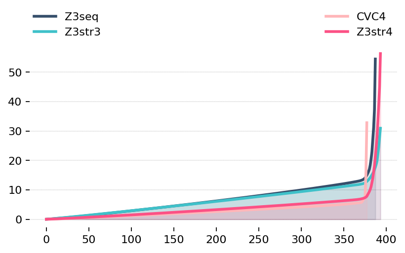

= Z3str4:
A Multi-armed String Solver
:toc: left
:stem:

We present a set of novel algorithms and optimization heuristics  implemented as part of a new solver, we call Z3str4, for a rich quantifier-free first-order theory of string equations, related functions (e.g., concat and replace) and predicates (e.g., contains), linear arithmetic over string lengths, and (in)equalities over integers. The key insights underlying our solver are threefold. First, we present a novel length abstraction solver that performs a linear arithmetic abstraction of string formulas (in a CEGAR-style loop), and refines as necessary. Second, we present another novel CDCL(T)-style algorithm that combines length abstraction and a bit-vector model construction method with the previously known arrangement technique for solving string formulas. Third, we present the algorithm selection architecture of Z3str4 which leverages four different solvers (arms), namely, the above-mentioned length abstraction solver, two versions of the above-mentioned arrangement solver, and the Z3 sequence solver. We perform extensive empirical evaluation over 16 different industrial and randomly-generated benchmarks with over 60,000 instances in them, and show Z3str4 outperforms previous best solvers, namely, CVC4, Z3 sequence solver, and the baseline Z3str3 on 13 of the 16 benchmarks. On the basis of total runtime over all 16 benchmarks, Z3str4 is competitive with CVC4 and significantly better than Z3 sequence and baseline Z3str3 solvers.

== Z3str4 String Solver
This website walks you through the basics of our new string solver Z3str4. We share the following components presented in our corresponding paper:

1. Source code

2. Benchmark suite (Benchmarks included) - https://z3str4.github.io/zaligVinder.tar.gz[Download]

3. All Benchmark tracks - https://z3str4.github.io/benchmarks.tar.gz[Download]

=== Compiling Z3str4

Navigate to the z3str4 folder by `cd z3str4` and execute the following steps:

1. `mkdir build`

2. `cd build`

3. `cmake -DCMAKE_BUILD_TYPE=Release ..`

4. `make -j4`

Now Z3str4 is compiled and setup for the benchmark tool.

=== Running Z3str4:
Z3str4 is invoked from the command line with `./z3 smt.string_solver=z3str3 dump_models=true  inputFile.smt` where `inputFile.smt` is the configuration file for Z3str4, the parameter `smt.string_solver` selects our theory, and `dump_models` asks Z3 to produce the found model.

=== Simple Example
Using Z3str4 to solve the string constraint `x0 = x1x2` and `x0 = solution` is as simple as providing the below configuration file to Z3str4.

----
(set-logic QF_S)
(declare-fun x0 () String)
(declare-fun x1 () String)
(declare-fun x2 () String)
(assert (= x0 (str.++ x1 x2)))
(assert (= x0 "solution"))
(check-sat)
----

As can be seen from the output below, Z3str4 finds a solution to the equation where it sets `x0 = solution`, `x1` and `x2` are set to the empty string.

----
sat
(model 
(define-fun x0 () String
"solution")
(define-fun x1 () String
"")
(define-fun x2 () String
"")
)
----

=== Trying the different features of Z3str4
The following information is given inside the help command of Z3str4. The selection corresponds to the newly added parameters directly related to our presented work. The following parameters require the choice of using Z3str3 as the main solver for string constraints. Simply pass `smt.string_solver=z3str3` to your binary to enable it.

==== Using the different arms separately

----
str.tactic (unsigned int)
----

Bypass tactic selection for testing purposes (Z3str3 only) 0 - all tactics, 1 - length abstraction, 2 - arrangement solver (default: 0)

==== Configuration of the length abstraction solver arm

----
str.fixed_length_iterations (unsigned int)
----

Maximum number of attempts to try preprocessing (Z3str3 only) (default: 1000)

==== Configuration of the sequence solver arm

----
str.pre_milliseconds (unsigned int)
----

Number milliseconds to try sequence solver for disjunctive queries (Z3str3 only) (default: 1000)

==== Using the overlaps feature

----
str.search_overlaps (bool)
----

Continue searching when overlapping variables are detected instead of skipping the branch and returning UNKNOWN (Z3str3 only) (default: true)

----
str.search_overlaps_milliseconds (unsigned int) 
----

number of milliseconds to try searching overlaps with the arrangement solver (Z3str3 only) (default: 5000)

==== Using the constraint sharing between arms

----
str.share_constraints (bool)
----

Enable constraint sharing across tactics (Z3str3 only, has no effect outside of portfolio tactic) (default: true)

== Competing string solvers

As describe in the corresponding paper we are comparing our approach against https://github.com/Z3Prover/z3[Z3Seq], https://sites.google.com/site/z3strsolver/[Z3Str3], and https://cvc4.github.io[CVC4].

=== Z3 Sequence Solver
The Z3 theorem prover  is a DPLL(T)-based SMT solver for theory combinations
over first-order logic. Z3 includes an arithmetic solver for linear integer arithmetic
and a sequence solver (Z3Seq) that supports word-based reasoning about strings.

=== Z3Str3 String Solver
The Z3str3 solver is based on Z3. It uses a reduction known as the arrangement technique to convert word equations into simpler
formulas until a "solved form" is reached. 

=== CVC4 String Solver
The CVC4 solver handles constraints over the theory of strings and arithmetic
using an algebraic approach, and uses a similar DPLL(T) architecture to Z3.

=== Availability
Within the comparison we used CVC4's binary version 1.7 which is available at https://github.com/CVC4/CVC4/releases/download/1.7/cvc4-1.7-x86_64-linux-opt[here]. The sequence solver and Z3str3 were pulled from their official https://github.com/Z3Prover/z3[GIT repository]. To reproduce our results you have to compile the commit https://github.com/Z3Prover/z3/commit/153d0661fe65247d0004bd4577ca851848ca4729[#153d0661fe65247d0004bd4577ca851848ca4729] using the same steps as described above for Z3str4.

== Reproduction of our Results

[WARNING]
This benchmark tool was tested on Python 3.7.6.

To reproduce our results presented in the paper navigate to the benchmarks folder by `cd wordbenchmarks` and execute the following steps:

. Modify the `toolconfig.json` according to your filepaths:

----
{
"Binaries" : {
		"Z3str4" : {
			"path" : "../tools/Z3str4/z3"
		},
		"Z3" : {
			"path" : "../tools/z3/z3"
		},
		"cvc4" : {
			"path" : "../tools/cvc4/cvc4"
		}
	}
}
----

[start=2]
. Install the python3 libs matplotlib, tabulate and npyscreen by executing:

`pip3 install matplotlib tabulate npyscreen`

[start=3]
. Start the benchmark run by executing 

`python3 z3str4run`

Once the benchmark run finished, the tool automatically starts a webserver on your local machine. You can browse the results by visiting the URL http://localhost:8081.

[.text-center]
image::benchmarkGUI.png[GUI Screenshot]

== A detailed view on our Results

All tests were performed on a server running Ubuntu 18.04.3 LTS with 2 Intel Xeon Gold 6242 CPUs each having 16 cores and 1.5 TB of memory.

=== PyEx

[.text-center]

|===
|Tool name |Correctly classified  |Declared satisfiable |Declared unsatisfiable |Declared unknown |Error |Program crashes| Timeout |Total instances |Total time |Total time w/o TO
|Z3seq|7750|6404|1366|0|20|0|644|8414.00|19764.624465656467|6884.62
|Z3str3|3015|1675|1343|214|3|211|5182|8414.00|108451.727125871|4811.73
|CVC4|7562|6205|1357|0|0|0|852|8414.00|24620.90423851181|7580.90
|Z3str4|7410|6048|1362|27|0|23|977|8414.00|22205.029225625098|2665.03
|===

[NOTE]
====
Best solver of this benchmark set Z3seq classified 7750 instances in 19764.624465656467s.
==== 

=== Pisa

[.text-center]

|===
|Tool name |Correctly classified  |Declared satisfiable |Declared unsatisfiable |Declared unknown |Error |Program crashes| Timeout |Total instances |Total time |Total time w/o TO
|Z3seq|12|8|4|0|0|0|0|12.00|0.5085268253460526|0.51
|Z3str3|11|7|4|0|0|0|1|12.00|20.440567634999752|0.44
|CVC4|12|8|4|0|0|0|0|12.00|2.111461312510073|2.11
|Z3str4|12|8|4|0|0|0|0|12.00|0.3947620401158929|0.39
|===

[NOTE]
====
Best solver of this benchmark set Z3str4 classified 12 instances in 0.3947620401158929s.
==== 

=== Norn

[.text-center]

|===
|Tool name |Correctly classified  |Declared satisfiable |Declared unsatisfiable |Declared unknown |Error |Program crashes| Timeout |Total instances |Total time |Total time w/o TO
|Z3seq|631|527|104|40|0|0|356|1027.00|8667.501249474473|1547.50
|Z3str3|725|646|79|34|0|0|268|1027.00|5417.398601915687|57.40
|CVC4|841|655|186|0|0|0|186|1027.00|3824.4693173654377|104.47
|Z3str4|715|616|99|39|0|0|273|1027.00|6434.981609395705|974.98
|===

[NOTE]
====
Best solver of this benchmark set CVC4 classified 841 instances in 3824.4693173654377s.
==== 

=== Trau Light

[.text-center]

|===
|Tool name |Correctly classified  |Declared satisfiable |Declared unsatisfiable |Declared unknown |Error |Program crashes| Timeout |Total instances |Total time |Total time w/o TO
|Z3seq|98|4|94|0|0|0|2|100.00|44.41716534923762|4.42
|Z3str3|97|4|93|1|0|0|2|100.00|43.08289780002087|3.08
|CVC4|97|3|94|0|0|0|3|100.00|62.99438211880624|2.99
|Z3str4|97|4|93|1|0|0|2|100.00|48.591934212483466|8.59
|===

[NOTE]
====
Best solver of this benchmark set Z3str3 classified 97 instances in 43.08289780002087s.
==== 

=== Leetcode Strings

[.text-center]

|===
|Tool name |Correctly classified  |Declared satisfiable |Declared unsatisfiable |Declared unknown |Error |Program crashes| Timeout |Total instances |Total time |Total time w/o TO
|Z3seq|2644|881|1785|0|22|0|0|2666.00|96.57261982839555|96.57
|Z3str3|2411|626|1785|153|0|1|102|2666.00|2343.0447438191622|303.04
|CVC4|2665|880|1785|0|0|0|1|2666.00|302.7353911437094|282.74
|Z3str4|2665|880|1785|1|0|0|0|2666.00|76.83403500169516|76.83
|===

[NOTE]
====
Best solver of this benchmark set Z3str4 classified 2665 instances in 76.83403500169516s.
==== 

=== IBM Appscan

[.text-center]

|===
|Tool name |Correctly classified  |Declared satisfiable |Declared unsatisfiable |Declared unknown |Error |Program crashes| Timeout |Total instances |Total time |Total time w/o TO
|Z3seq|7|7|0|0|0|0|1|8.00|21.84341488685459|1.84
|Z3str3|3|3|0|0|0|0|5|8.00|100.11775264330208|0.12
|CVC4|7|7|0|0|0|0|1|8.00|36.73005310911685|16.73
|Z3str4|4|4|0|2|0|1|2|8.00|58.58092068042606|18.58
|===

[NOTE]
====
Best solver of this benchmark set Z3seq classified 7 instances in 21.84341488685459s.
==== 

=== Sloth

[.text-center]

|===
|Tool name |Correctly classified  |Declared satisfiable |Declared unsatisfiable |Declared unknown |Error |Program crashes| Timeout |Total instances |Total time |Total time w/o TO
|Z3seq|23|11|12|15|0|0|2|40.00|42.058595802634954|2.06
|Z3str3|19|10|9|16|0|0|5|40.00|101.23511372692883|1.24
|CVC4|37|21|16|0|0|0|3|40.00|60.88837200868875|0.89
|Z3str4|23|11|12|16|0|0|1|40.00|34.71057705022395|14.71
|===

[NOTE]
====
Best solver of this benchmark set Z3str4 classified 23 instances in 34.71057705022395s.
==== 

=== Woorpje Word Equations

[.text-center]

|===
|Tool name |Correctly classified  |Declared satisfiable |Declared unsatisfiable |Declared unknown |Error |Program crashes| Timeout |Total instances |Total time |Total time w/o TO
|Z3seq|699|535|164|0|0|0|110|809.00|2499.12032032758|299.12
|Z3str3|670|507|172|15|9|0|115|809.00|2459.4978417549282|159.50
|CVC4|699|537|163|0|1|0|109|809.00|2330.339424391277|150.34
|Z3str4|722|558|164|7|0|0|80|809.00|1743.6630762815475|143.66
|===

[NOTE]
====
Best solver of this benchmark set Z3str4 classified 722 instances in 1743.6630762815475s.
==== 

=== Kaluza

[.text-center]

|===
|Tool name |Correctly classified  |Declared satisfiable |Declared unsatisfiable |Declared unknown |Error |Program crashes| Timeout |Total instances |Total time |Total time w/o TO
|Z3seq|44915|33116|11799|0|0|0|2369|47284.00|52016.070272464305|4636.07
|Z3str3|46224|34425|11799|224|0|0|836|47284.00|20398.514478715137|3678.51
|CVC4|46946|34932|12014|0|0|0|338|47284.00|15289.533664392307|8529.53
|Z3str4|46620|34617|12003|50|0|0|614|47284.00|21981.995113225654|9702.00
|===

[NOTE]
====
Best solver of this benchmark set CVC4 classified 46946 instances in 15289.533664392307s.
==== 

=== StringFuzz

[.text-center]

|===
|Tool name |Correctly classified  |Declared satisfiable |Declared unsatisfiable |Declared unknown |Error |Program crashes| Timeout |Total instances |Total time |Total time w/o TO
|Z3seq|597|397|200|0|0|0|468|1065.00|10019.852157360874|659.85
|Z3str3|776|593|183|4|0|0|285|1065.00|6036.293701956049|336.29
|CVC4|879|621|258|0|0|0|186|1065.00|4083.968703418039|363.97
|Z3str4|1012|714|298|0|0|0|53|1065.00|2762.429431346245|1702.43
|===

[NOTE]
====
Best solver of this benchmark set Z3str4 classified 1012 instances in 2762.429431346245s.
==== 

=== z3Str3 Regression

[.text-center]

|===
|Tool name |Correctly classified  |Declared satisfiable |Declared unsatisfiable |Declared unknown |Error |Program crashes| Timeout |Total instances |Total time |Total time w/o TO
|Z3seq|242|197|45|1|0|0|0|243.00|12.03635145444423|12.04
|Z3str3|237|194|43|1|0|0|5|243.00|107.99180989991874|7.99
|CVC4|227|183|44|0|0|0|16|243.00|326.0331924185157|6.03
|Z3str4|242|197|45|1|0|0|0|243.00|4.517238111235201|4.52
|===

[NOTE]
====
Best solver of this benchmark set Z3str4 classified 242 instances in 4.517238111235201s.
==== 

=== Cashew

[.text-center]

|===
|Tool name |Correctly classified  |Declared satisfiable |Declared unsatisfiable |Declared unknown |Error |Program crashes| Timeout |Total instances |Total time |Total time w/o TO
|Z3seq|388|376|12|0|0|0|6|394.00|174.43052376806736|54.43
|Z3str3|394|382|12|0|0|0|0|394.00|30.923583981581032|30.92
|CVC4|378|366|12|0|0|0|16|394.00|352.78678010590374|32.79
|Z3str4|394|382|12|0|0|0|0|394.00|56.27369636762887|56.27
|===

[NOTE]
====
Best solver of this benchmark set Z3str3 classified 394 instances in 30.923583981581032s.
==== 

=== JOACO

[.text-center]

|===
|Tool name |Correctly classified  |Declared satisfiable |Declared unsatisfiable |Declared unknown |Error |Program crashes| Timeout |Total instances |Total time |Total time w/o TO
|Z3seq|32|12|20|57|0|0|5|94.00|271.23769912309945|171.24
|Z3str3|37|17|20|57|0|0|0|94.00|3.769204800017178|3.77
|CVC4|78|57|21|0|0|0|16|94.00|322.85813359357417|2.86
|Z3str4|37|17|20|57|0|0|0|94.00|87.4218874508515|87.42
|===

[NOTE]
====
Best solver of this benchmark set Z3str3 classified 37 instances in 3.769204800017178s.
==== 

=== Stranger

[.text-center]

|===
|Tool name |Correctly classified  |Declared satisfiable |Declared unsatisfiable |Declared unknown |Error |Program crashes| Timeout |Total instances |Total time |Total time w/o TO
|Z3seq|4|4|0|0|0|0|0|4.00|34.70068748947233|34.70
|Z3str3|4|4|0|0|0|0|0|4.00|0.25243187230080366|0.25
|CVC4|0|0|0|0|0|0|4|4.00|80|0.00
|Z3str4|4|4|0|0|0|0|0|4.00|20.390589385293424|20.39
|===

[NOTE]
====
Best solver of this benchmark set Z3str3 classified 4 instances in 0.25243187230080366s.
==== 

=== Kausler

[.text-center]

|===
|Tool name |Correctly classified  |Declared satisfiable |Declared unsatisfiable |Declared unknown |Error |Program crashes| Timeout |Total instances |Total time |Total time w/o TO
|Z3seq|118|118|0|0|0|0|2|120.00|69.9316820576787|29.93
|Z3str3|118|118|0|0|0|0|2|120.00|150.52100761141628|110.52
|CVC4|120|120|0|0|0|0|0|120.00|58.962984412908554|58.96
|Z3str4|81|81|0|0|0|0|39|120.00|1127.2833331413567|347.28
|===

[NOTE]
====
Best solver of this benchmark set CVC4 classified 120 instances in 58.962984412908554s.
==== 

=== BanditFuzz

[.text-center]

|===
|Tool name |Correctly classified  |Declared satisfiable |Declared unsatisfiable |Declared unknown |Error |Program crashes| Timeout |Total instances |Total time |Total time w/o TO
|Z3seq|346|53|293|0|0|0|11|357.00|297.37302767205983|77.37
|Z3str3|311|25|287|1|1|1|44|357.00|939.9494499629363|59.95
|CVC4|337|57|280|0|0|0|20|357.00|670.2352838544175|270.24
|Z3str4|345|52|293|1|0|1|11|357.00|264.54628120269626|44.55
|===

[NOTE]
====
Best solver of this benchmark set Z3str4 classified 345 instances in 264.54628120269626s.
==== 

=== Total

[.text-center]

|===
|Tool name |Correctly classified  |Declared satisfiable |Declared unsatisfiable |Declared unknown |Error |Program crashes| Timeout |Total instances |Total time |Total time w/o TO
|Z3seq|58506|42650|15898|113|42|0|3976|62637.00|94032.27875954099|14512.28
|Z3str3|55052|39236|15829|720|13|213|6852|62637.00|146604.76031396538|9564.76
|CVC4|60885|44652|16234|0|1|0|1751|62637.00|52425.55138215702|17405.55
|Z3str4|60383|44193|16190|202|0|25|2052|62637.00|56907.643710518256|15867.64
|===

