= Z3str4
A Multi-armed String Solver
:toc: left
:stem:

Z3str4 is an SMT solver for the SMT-LIB theory of strings based on Z3. The solver includes two new algorithms for string solving: a length abstraction algorithm and an abstraction-refinement reduction to bit-vectors. Z3str4 also includes an algorithm selection architecture which chooses the best algorithms to run based on their expected performance on the input. This page contains information on downloading and using Z3str4, as well as the results of an extensive experimental evaluation against other leading string solvers.

== Z3str4 String Solver
This website consists of supplementary material to our paper (currently under submission). We share the following components presented in our corresponding paper:

1. Reproduction package - http://informatik.uni-kiel.de/~mku/fm.tar.gz[Download]

Untar the package by executing ``tar xf fm.tar.gz`` which will create a folder called ``FM``. 

=== Compiling Z3str4

We include a bash script named ``compileZ3str4.sh`` which compiles the provided source code. To compile the solver you simply have to execute 

```
bash compileZ3str4.sh
```

Now Z3str4 is compiled within ``tool_source/build`` and ready to run.

=== Running Z3str4:
Z3str4 is invoked from the command line with `./z3 smt.string_solver=z3str3 unicode=false smt.str.tactic=3probe smt.arith.solver=2 inputFile.smt` where `inputFile.smt` is the desired SMT-LIB instance, the parameter `dump_models` asks Z3 to output the found model (if it answers SAT).

=== Simple Example
Using Z3str4 to solve the string constraint `x0 = x1 . x2` and `x0 = solution` is as simple as providing the instance below to Z3str4.

----
(set-logic QF_S)
(declare-fun x0 () String)
(declare-fun x1 () String)
(declare-fun x2 () String)
(assert (= x0 (str.++ x1 x2)))
(assert (= x0 "solution"))
(check-sat)
----

As can be seen from the output below, Z3str4 finds a solution to the equation where it sets `x0 = solution`, and `x1` and `x2` are set to the empty string.

----
sat
(model 
(define-fun x0 () String
"solution")
(define-fun x1 () String
"")
(define-fun x2 () String
"")
)
----

=== Trying the different features of Z3str4
The following information is given inside the help command of Z3str4. The selection corresponds to the newly added parameters directly related to our presented work. The following parameters require the choice of using Z3str3 as the main solver for string constraints. Simply pass `smt.string_solver=z3str3` to your binary to enable it.

==== Using algorithms in isolation

----
str.tactic (unsigned int)
----

This option changes which algorithms (resp. arms) are used. 

- ``3probe`` all algorithms as presented in the paper
- ``regex`` only use the regex arm
- ``seq`` only use the sequence solver arm
- ``alwayscf`` only use the conjunctive fragment arm
- ``nevercf`` only use the non-conjunctive fragment arm


Use one of the following parameters to run a single solver within Z3str4

- ``las`` length abstraction,
- ``arr`` arrangement solver 
- ``seq``sequence solver


==== Using the constraint sharing between arms

----
str.share_constraints (bool)
----

Enable constraint sharing across tactics (Z3str3 only, has no effect outside of portfolio tactic) (default: true)

== Competing string solvers

As describe in the corresponding paper we are comparing our approach against https://github.com/Z3Prover/z3[Z3Seq], https://sites.google.com/site/z3strsolver/[Z3Str3], and https://cvc4.github.io[CVC4].

=== Z3 Sequence Solver
The Z3 theorem prover  is a DPLL(T)-based SMT solver for theory combinations
over first-order logic. Z3 includes an arithmetic solver for linear integer arithmetic
and a sequence solver (Z3Seq) that supports word-based reasoning about strings.

=== Z3Str3 String Solver
The Z3str3 solver is based on Z3. It uses a reduction known as the arrangement technique to convert word equations into simpler
formulas until a "solved form" is reached. 

=== CVC4 String Solver
The CVC4 solver handles constraints over the theory of strings and arithmetic
using an algebraic approach, and uses a similar DPLL(T) architecture to Z3.

=== Availability
Within the comparison we used CVC4's binary version 1.8 which is available at https://github.com/CVC4[here]. The sequence solver and Z3str3 were pulled from their official https://github.com/Z3Prover/z3[GIT repository]. We used commit https://github.com/Z3Prover/z3/commit/7e7360dd0c04cdee95c3f74a59908209742c5212[#7e7360dd0c04cdee95c3f74a59908209742c5212] of Z3. All pre compiled binaries are included within our reproduction package (``FM/SolverBinaries``). 


== Reproduction of our Results

[WARNING]
This benchmark tool was tested on Python 3.9.

=== Install the prerequisites 
To install the required packages we provide a script called ``installTools.sh``. Executing
	```bash installTools.sh```
installs all dependencies needed for running our solver and reproducing our empirical evaluation.

In order to reproduce the figures presented in the paper you need a LaTeX environment. The following command downloads the 
required packages for Ubuntu like systems


```
sudo -S apt-get -y install latexmk texlive-latex-recommended texlive-latex-extra texlive-fonts-extra asciidoctor
```

These packages are not needed to reproduce our results. 

==== Repeating the run using all solvers on all presented benchmarks (including the bit-vector experiment and clause-sharing):
```
bash runAll.sh
```
==== Repeating the run including the fragment analysis:
```
bash runFragment.sh
```

After the ZaligVinder run has finished a webserver is started. You can review the results by guiding your browser to http://localhost:8081.

=== Further post analysis steps
Within the ZaligVinder folder ``zaligvinder`` we stored the database of our experimental evaluation.

==== Inspecting the results within the web browser:
Execute the following commands to review our results within ZaligVinder's web gui:

```
cd zaligvinder
python3 startwebserver.py fm_all.db
```

Afterwards navigate to http://localhost:8081 in your web browser.

==== Generate an tables, plots and ASCII Doctor web page to review the results:
Execute the following commands

```
cd zaligvinder
python3 tablegen.py
```
which will open a terminal gui. Select ``fm_all.db`` as database and a place to store the output file -- entering no output name stores the output data within the folder ``zaligvinder/external_data/<today's_date>``. Afterwards you are able to select the benchmark sets of your choice being present within our run and the solvers. Bye selecting the database ``fm_frag.db`` you are able to explore the fragment experiment.


Next step is selecting whether you want to generate the cactus plots, tables or the ASCII Doctor page.

===== Tables and Plots.
Tables and plots need to be compiled by using ``latexmk``. Simply execute

```
latexmk -pdf <yourFileName>
```

to generate a PDF.

===== Generating HTML for the ASCII doctor page.
To view the ASCII Doctor page conveniently in your browser execute

```
asciidoctor <yourFileName>
```

which will create a ``<yourFileName>.html`` file. To open firefox execute ``firefox <yourFileName>.html``.

You can perform these post analysis steps on your own generated database too. To do so instead of using ``fm_all.db`` within the terminal gui simply select your own generated database having a name similar to ``All_results_1611768687.585239.db`` for running the experiment on all benchmarks or ``Fragments_results_1611768687.585239.db`` if you selected the fragments experiment.


[.text-center]
image::benchmarkGUI.png[GUI Screenshot]

== A detailed view on our Results

All tests were performed on a server running Ubuntu 18.04.3 LTS with 2 Intel Xeon Gold 6242 CPUs each having 16 cores and 1.5 TB of memory.

= Benchmark Results

== General Experiment
=== PyEx

[.text-center]
image::img_ALL/pyex.png[cactus]

|===
|Solver |Cor. class. (contr.) |SAT |UNSAT |UNKN |ERR |CRA |TO |Par2 |Tot. inst. |Tot. inst. w/o TO | Tot. time |Tot. time w/o TO
|+++<span style="color: #25333D;font-weight: bold;">CVC4</span>+++|24777 (31.96)|11003|13774|0|0|0|644|33671284|25421|24777|20791284|7911284
|+++<span style="color: #00D4B8;font-weight: bold;">Z3str4</span>+++|24483 (1.46)|10789|13694|37|0|0|901|52372918|25421|24520|32872918|14852918
|+++<span style="color: #FF9A69;font-weight: bold;">Z3str4-seq</span>+++|24409 (0.11)|10723|13686|35|0|0|977|55563330|25421|24444|34623330|15083330
|+++<span style="color: #0065AB;font-weight: bold;">Z3seq</span>+++|24099 (2.24)|10380|13719|2|0|0|1320|76784822|25421|24101|50304822|23904822
|+++<span style="color: #80746D;font-weight: bold;">Z3str4-regex</span>+++|21914 (0.34)|8207|13707|17|0|0|3490|143397636|25421|21931|72917636|3117636
|+++<span style="color: #318700;font-weight: bold;">Z3str4-nevercf</span>+++|21866 (0.0)|8159|13707|21|0|0|3534|145291844|25421|21887|73771844|3091844
|+++<span style="color: #CD3517;font-weight: bold;">Z3str4-alwayscf</span>+++|16006 (21.98)|2323|13683|2039|0|130|7376|381003345|25421|18045|151923345|4403345
|+++<span style="color: #8939AD;font-weight: bold;">Z3str3</span>+++|14901 (0.34)|1151|13750|2|0|0|10518|421730508|25421|14903|211290508|930508
|+++<span style="color: #007E7A;font-weight: bold;">Z3str4-arr</span>+++|14848 (0.0)|1143|13705|240|0|0|10333|425001881|25421|15088|208741881|2081881
|+++<span style="color: #85C81A;font-weight: bold;">Z3str4-virtualBestSolver</span>+++|24713 (-)|11005|13708|182|0|0|526|40605271|25421|24895|23216571|12285271
|===

[NOTE]
====
+++<span style="color: #25333D;font-weight: bold;">CVC4</span>+++ had the biggest lead with 1.01 and +++<span style="color: #25333D;font-weight: bold;">CVC4</span>+++ hat the largest contribution with 31.96. Other solvers contributed as follows: +++<span style="color: #CD3517;font-weight: bold;">Z3str4-alwayscf</span>+++: 21.98,+++<span style="color: #0065AB;font-weight: bold;">Z3seq</span>+++: 2.24,+++<span style="color: #00D4B8;font-weight: bold;">Z3str4</span>+++: 1.46,+++<span style="color: #80746D;font-weight: bold;">Z3str4-regex</span>+++: 0.34,+++<span style="color: #8939AD;font-weight: bold;">Z3str3</span>+++: 0.34,+++<span style="color: #FF9A69;font-weight: bold;">Z3str4-seq</span>+++: 0.11,+++<span style="color: #007E7A;font-weight: bold;">Z3str4-arr</span>+++: 0.0,+++<span style="color: #318700;font-weight: bold;">Z3str4-nevercf</span>+++: 0.0.
====

=== SMTLIB25


[.text-center]
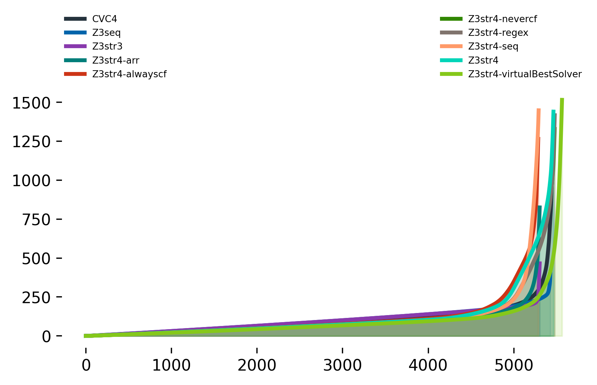

|===
|Solver |Cor. class. (contr.) |SAT |UNSAT |UNKN |ERR |CRA |TO |Par2 |Tot. inst. |Tot. inst. w/o TO | Tot. time |Tot. time w/o TO
|+++<span style="color: #80746D;font-weight: bold;">Z3str4-regex</span>+++|5478 (0.81)|1905|3573|79|0|0|356|19368328|5913|5557|9088328|1968328
|+++<span style="color: #318700;font-weight: bold;">Z3str4-nevercf</span>+++|5477 (0.46)|1894|3583|68|0|0|368|19285544|5913|5545|9205544|1845544
|+++<span style="color: #00D4B8;font-weight: bold;">Z3str4</span>+++|5463 (0.23)|1869|3594|6|0|0|444|19503735|5913|5469|10383735|1503735
|+++<span style="color: #25333D;font-weight: bold;">CVC4</span>+++|5462 (9.69)|1854|3608|1|0|0|450|19325827|5913|5463|10285827|1285827
|+++<span style="color: #0065AB;font-weight: bold;">Z3seq</span>+++|5427 (1.38)|1879|3548|0|0|0|486|19849425|5913|5427|10129425|409425
|+++<span style="color: #007E7A;font-weight: bold;">Z3str4-arr</span>+++|5302 (0.58)|1800|3502|77|0|0|534|25715170|5913|5379|11955170|1275170
|+++<span style="color: #FF9A69;font-weight: bold;">Z3str4-seq</span>+++|5290 (0.58)|1741|3549|10|0|0|613|26470630|5913|5300|13810630|1550630
|+++<span style="color: #CD3517;font-weight: bold;">Z3str4-alwayscf</span>+++|5285 (0.12)|1777|3508|59|0|9|569|26440910|5913|5344|12700910|1320910
|+++<span style="color: #8939AD;font-weight: bold;">Z3str3</span>+++|5302 (0.35)|1774|3529|99|1|0|511|25019511|5913|5402|10699511|479511
|+++<span style="color: #85C81A;font-weight: bold;">Z3str4-virtualBestSolver</span>+++|5563 (-)|1943|3620|81|0|0|269|15515984|5913|5644|7447864|1515984
|===

[NOTE]
====
+++<span style="color: #80746D;font-weight: bold;">Z3str4-regex</span>+++ had the biggest lead with 1.0 and +++<span style="color: #25333D;font-weight: bold;">CVC4</span>+++ hat the largest contribution with 9.69. Other solvers contributed as follows: +++<span style="color: #0065AB;font-weight: bold;">Z3seq</span>+++: 1.38,+++<span style="color: #80746D;font-weight: bold;">Z3str4-regex</span>+++: 0.81,+++<span style="color: #007E7A;font-weight: bold;">Z3str4-arr</span>+++: 0.58,+++<span style="color: #FF9A69;font-weight: bold;">Z3str4-seq</span>+++: 0.58,+++<span style="color: #318700;font-weight: bold;">Z3str4-nevercf</span>+++: 0.46,+++<span style="color: #8939AD;font-weight: bold;">Z3str3</span>+++: 0.35,+++<span style="color: #00D4B8;font-weight: bold;">Z3str4</span>+++: 0.23,+++<span style="color: #CD3517;font-weight: bold;">Z3str4-alwayscf</span>+++: 0.12.
====

=== Pisa


[.text-center]
image::img_ALL/pisa.png[cactus]

|===
|Solver |Cor. class. (contr.) |SAT |UNSAT |UNKN |ERR |CRA |TO |Par2 |Tot. inst. |Tot. inst. w/o TO | Tot. time |Tot. time w/o TO
|+++<span style="color: #25333D;font-weight: bold;">CVC4</span>+++|12 (0.0)|8|4|0|0|0|0|2363|12|12|2363|2363
|+++<span style="color: #8939AD;font-weight: bold;">Z3str3</span>+++|11 (0.0)|7|4|0|0|0|1|40705|12|11|20705|705
|+++<span style="color: #00D4B8;font-weight: bold;">Z3str4</span>+++|8 (0.0)|8|0|0|0|0|4|160583|12|8|80583|583
|+++<span style="color: #FF9A69;font-weight: bold;">Z3str4-seq</span>+++|8 (0.0)|8|0|0|0|0|4|160718|12|8|80718|718
|+++<span style="color: #318700;font-weight: bold;">Z3str4-nevercf</span>+++|8 (0.0)|8|0|0|0|0|4|160761|12|8|80761|761
|+++<span style="color: #80746D;font-weight: bold;">Z3str4-regex</span>+++|8 (0.0)|8|0|0|0|0|4|160787|12|8|80787|787
|+++<span style="color: #0065AB;font-weight: bold;">Z3seq</span>+++|8 (0.0)|8|0|0|0|0|4|160813|12|8|80813|813
|+++<span style="color: #CD3517;font-weight: bold;">Z3str4-alwayscf</span>+++|7 (0.0)|7|0|0|0|0|5|201446|12|7|101446|1446
|+++<span style="color: #007E7A;font-weight: bold;">Z3str4-arr</span>+++|6 (0.0)|6|0|0|0|0|6|240335|12|6|120335|335
|+++<span style="color: #85C81A;font-weight: bold;">Z3str4-virtualBestSolver</span>+++|8 (-)|8|0|0|0|0|4|160569|12|8|80569|569
|===

[NOTE]
====
+++<span style="color: #25333D;font-weight: bold;">CVC4</span>+++ had the biggest lead with 1.09 and +++<span style="color: #007E7A;font-weight: bold;">Z3str4-arr</span>+++ hat the largest contribution with 0.0. Other solvers contributed as follows: +++<span style="color: #25333D;font-weight: bold;">CVC4</span>+++: 0.0,+++<span style="color: #80746D;font-weight: bold;">Z3str4-regex</span>+++: 0.0,+++<span style="color: #318700;font-weight: bold;">Z3str4-nevercf</span>+++: 0.0,+++<span style="color: #8939AD;font-weight: bold;">Z3str3</span>+++: 0.0,+++<span style="color: #FF9A69;font-weight: bold;">Z3str4-seq</span>+++: 0.0,+++<span style="color: #CD3517;font-weight: bold;">Z3str4-alwayscf</span>+++: 0.0,+++<span style="color: #0065AB;font-weight: bold;">Z3seq</span>+++: 0.0,+++<span style="color: #00D4B8;font-weight: bold;">Z3str4</span>+++: 0.0.
====

=== Norn


[.text-center]
image::img_ALL/norn.png[cactus]

|===
|Solver |Cor. class. (contr.) |SAT |UNSAT |UNKN |ERR |CRA |TO |Par2 |Tot. inst. |Tot. inst. w/o TO | Tot. time |Tot. time w/o TO
|+++<span style="color: #00D4B8;font-weight: bold;">Z3str4</span>+++|954 (0.0)|712|242|0|0|0|73|3027248|1027|954|1567248|107248
|+++<span style="color: #80746D;font-weight: bold;">Z3str4-regex</span>+++|954 (0.0)|712|242|0|0|0|73|3033649|1027|954|1573649|113649
|+++<span style="color: #318700;font-weight: bold;">Z3str4-nevercf</span>+++|954 (0.0)|712|242|0|0|0|73|3034548|1027|954|1574548|114548
|+++<span style="color: #25333D;font-weight: bold;">CVC4</span>+++|932 (2.9)|710|222|0|0|0|95|3987855|1027|932|2087855|187855
|+++<span style="color: #FF9A69;font-weight: bold;">Z3str4-seq</span>+++|909 (0.0)|712|197|0|0|0|118|4768619|1027|909|2408619|48619
|+++<span style="color: #0065AB;font-weight: bold;">Z3seq</span>+++|907 (0.0)|712|195|0|0|0|120|4896291|1027|907|2496291|96291
|+++<span style="color: #007E7A;font-weight: bold;">Z3str4-arr</span>+++|883 (0.0)|693|190|0|0|0|144|5805341|1027|883|2925341|45341
|+++<span style="color: #CD3517;font-weight: bold;">Z3str4-alwayscf</span>+++|880 (0.7)|693|187|31|0|6|116|5963598|1027|911|2403598|83598
|+++<span style="color: #8939AD;font-weight: bold;">Z3str3</span>+++|653 (0.0)|510|143|0|0|0|374|14988522|1027|653|7508522|28522
|+++<span style="color: #85C81A;font-weight: bold;">Z3str4-virtualBestSolver</span>+++|960 (-)|712|248|9|0|0|58|2758293|1027|969|1244077|78293
|===

[NOTE]
====
+++<span style="color: #00D4B8;font-weight: bold;">Z3str4</span>+++ had the biggest lead with 1.0 and +++<span style="color: #25333D;font-weight: bold;">CVC4</span>+++ hat the largest contribution with 2.9. Other solvers contributed as follows: +++<span style="color: #CD3517;font-weight: bold;">Z3str4-alwayscf</span>+++: 0.7,+++<span style="color: #007E7A;font-weight: bold;">Z3str4-arr</span>+++: 0.0,+++<span style="color: #80746D;font-weight: bold;">Z3str4-regex</span>+++: 0.0,+++<span style="color: #318700;font-weight: bold;">Z3str4-nevercf</span>+++: 0.0,+++<span style="color: #8939AD;font-weight: bold;">Z3str3</span>+++: 0.0,+++<span style="color: #FF9A69;font-weight: bold;">Z3str4-seq</span>+++: 0.0,+++<span style="color: #0065AB;font-weight: bold;">Z3seq</span>+++: 0.0,+++<span style="color: #00D4B8;font-weight: bold;">Z3str4</span>+++: 0.0.
====

=== Trau Light


[.text-center]
image::img_ALL/traulight.png[cactus]

|===
|Solver |Cor. class. (contr.) |SAT |UNSAT |UNKN |ERR |CRA |TO |Par2 |Tot. inst. |Tot. inst. w/o TO | Tot. time |Tot. time w/o TO
|+++<span style="color: #80746D;font-weight: bold;">Z3str4-regex</span>+++|98 (0.0)|4|94|1|0|0|1|92966|100|99|32966|12966
|+++<span style="color: #318700;font-weight: bold;">Z3str4-nevercf</span>+++|98 (0.0)|4|94|1|0|0|1|93787|100|99|33787|13787
|+++<span style="color: #25333D;font-weight: bold;">CVC4</span>+++|98 (0.0)|4|94|0|0|0|2|82180|100|98|42180|2180
|+++<span style="color: #FF9A69;font-weight: bold;">Z3str4-seq</span>+++|98 (0.0)|4|94|0|0|0|2|86661|100|98|46661|6661
|+++<span style="color: #0065AB;font-weight: bold;">Z3seq</span>+++|98 (0.0)|4|94|0|0|0|2|87527|100|98|47527|7527
|+++<span style="color: #007E7A;font-weight: bold;">Z3str4-arr</span>+++|97 (0.0)|4|93|1|0|0|2|133050|100|98|53050|13050
|+++<span style="color: #00D4B8;font-weight: bold;">Z3str4</span>+++|97 (0.0)|4|93|0|0|0|3|124388|100|97|64388|4388
|+++<span style="color: #CD3517;font-weight: bold;">Z3str4-alwayscf</span>+++|97 (0.0)|4|93|0|0|0|3|125660|100|97|65660|5660
|+++<span style="color: #8939AD;font-weight: bold;">Z3str3</span>+++|97 (0.0)|4|93|0|0|0|3|127363|100|97|67363|7363
|+++<span style="color: #85C81A;font-weight: bold;">Z3str4-virtualBestSolver</span>+++|98 (-)|4|94|1|0|0|1|83247|100|99|29427|3247
|===

[NOTE]
====
+++<span style="color: #80746D;font-weight: bold;">Z3str4-regex</span>+++ had the biggest lead with 1.0 and +++<span style="color: #007E7A;font-weight: bold;">Z3str4-arr</span>+++ hat the largest contribution with 0.0. Other solvers contributed as follows: +++<span style="color: #25333D;font-weight: bold;">CVC4</span>+++: 0.0,+++<span style="color: #80746D;font-weight: bold;">Z3str4-regex</span>+++: 0.0,+++<span style="color: #318700;font-weight: bold;">Z3str4-nevercf</span>+++: 0.0,+++<span style="color: #8939AD;font-weight: bold;">Z3str3</span>+++: 0.0,+++<span style="color: #FF9A69;font-weight: bold;">Z3str4-seq</span>+++: 0.0,+++<span style="color: #CD3517;font-weight: bold;">Z3str4-alwayscf</span>+++: 0.0,+++<span style="color: #0065AB;font-weight: bold;">Z3seq</span>+++: 0.0,+++<span style="color: #00D4B8;font-weight: bold;">Z3str4</span>+++: 0.0.
====

=== Leetcode Strings


[.text-center]
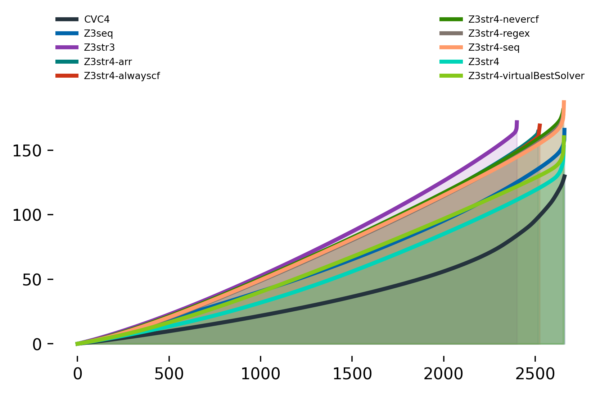

|===
|Solver |Cor. class. (contr.) |SAT |UNSAT |UNKN |ERR |CRA |TO |Par2 |Tot. inst. |Tot. inst. w/o TO | Tot. time |Tot. time w/o TO
|+++<span style="color: #25333D;font-weight: bold;">CVC4</span>+++|2661 (0.0)|850|1811|0|0|0|0|129591|2661|2661|129591|129591
|+++<span style="color: #0065AB;font-weight: bold;">Z3seq</span>+++|2661 (0.0)|850|1811|0|0|0|0|165675|2661|2661|165675|165675
|+++<span style="color: #FF9A69;font-weight: bold;">Z3str4-seq</span>+++|2658 (0.0)|847|1811|0|0|0|3|307091|2661|2658|247091|187091
|+++<span style="color: #00D4B8;font-weight: bold;">Z3str4</span>+++|2657 (0.0)|846|1811|1|0|0|3|312633|2661|2658|212633|152633
|+++<span style="color: #80746D;font-weight: bold;">Z3str4-regex</span>+++|2654 (0.0)|843|1811|0|0|0|7|456843|2661|2654|316843|176843
|+++<span style="color: #318700;font-weight: bold;">Z3str4-nevercf</span>+++|2654 (0.0)|843|1811|0|0|0|7|460782|2661|2654|320782|180782
|+++<span style="color: #CD3517;font-weight: bold;">Z3str4-alwayscf</span>+++|2526 (0.0)|715|1811|33|0|0|102|5590085|2661|2559|2230085|190085
|+++<span style="color: #007E7A;font-weight: bold;">Z3str4-arr</span>+++|2517 (0.0)|706|1811|14|0|0|130|5962291|2661|2531|2802291|202291
|+++<span style="color: #8939AD;font-weight: bold;">Z3str3</span>+++|2401 (0.0)|590|1811|126|0|0|134|10580725|2661|2527|2860725|180725
|+++<span style="color: #85C81A;font-weight: bold;">Z3str4-virtualBestSolver</span>+++|2658 (-)|847|1811|0|0|0|3|279949|2661|2658|219949|159949
|===

[NOTE]
====
+++<span style="color: #25333D;font-weight: bold;">CVC4</span>+++ had the biggest lead with 1.0 and +++<span style="color: #007E7A;font-weight: bold;">Z3str4-arr</span>+++ hat the largest contribution with 0.0. Other solvers contributed as follows: +++<span style="color: #25333D;font-weight: bold;">CVC4</span>+++: 0.0,+++<span style="color: #80746D;font-weight: bold;">Z3str4-regex</span>+++: 0.0,+++<span style="color: #318700;font-weight: bold;">Z3str4-nevercf</span>+++: 0.0,+++<span style="color: #8939AD;font-weight: bold;">Z3str3</span>+++: 0.0,+++<span style="color: #FF9A69;font-weight: bold;">Z3str4-seq</span>+++: 0.0,+++<span style="color: #CD3517;font-weight: bold;">Z3str4-alwayscf</span>+++: 0.0,+++<span style="color: #0065AB;font-weight: bold;">Z3seq</span>+++: 0.0,+++<span style="color: #00D4B8;font-weight: bold;">Z3str4</span>+++: 0.0.
====

=== IBM Appscan


[.text-center]
image::img_ALL/ibmappscan.png[cactus]

|===
|Solver |Cor. class. (contr.) |SAT |UNSAT |UNKN |ERR |CRA |TO |Par2 |Tot. inst. |Tot. inst. w/o TO | Tot. time |Tot. time w/o TO
|+++<span style="color: #25333D;font-weight: bold;">CVC4</span>+++|8 (0.0)|8|0|0|0|0|0|7967|8|8|7967|7967
|+++<span style="color: #FF9A69;font-weight: bold;">Z3str4-seq</span>+++|8 (0.0)|8|0|0|0|0|0|14710|8|8|14710|14710
|+++<span style="color: #0065AB;font-weight: bold;">Z3seq</span>+++|6 (0.0)|6|0|0|0|0|2|87342|8|6|47342|7342
|+++<span style="color: #CD3517;font-weight: bold;">Z3str4-alwayscf</span>+++|5 (0.0)|5|0|0|0|0|3|120484|8|5|60484|484
|+++<span style="color: #007E7A;font-weight: bold;">Z3str4-arr</span>+++|5 (0.0)|5|0|0|0|0|3|120506|8|5|60506|506
|+++<span style="color: #00D4B8;font-weight: bold;">Z3str4</span>+++|5 (0.0)|5|0|0|0|0|3|121421|8|5|61421|1421
|+++<span style="color: #80746D;font-weight: bold;">Z3str4-regex</span>+++|5 (0.0)|5|0|0|0|0|3|121472|8|5|61472|1472
|+++<span style="color: #318700;font-weight: bold;">Z3str4-nevercf</span>+++|5 (0.0)|5|0|0|0|0|3|121580|8|5|61580|1580
|+++<span style="color: #8939AD;font-weight: bold;">Z3str3</span>+++|5 (0.0)|5|0|0|0|0|3|129763|8|5|69763|9763
|+++<span style="color: #85C81A;font-weight: bold;">Z3str4-virtualBestSolver</span>+++|8 (-)|8|0|0|0|0|0|12907|8|8|12907|12907
|===

[NOTE]
====
+++<span style="color: #25333D;font-weight: bold;">CVC4</span>+++ had the biggest lead with 1.0 and +++<span style="color: #007E7A;font-weight: bold;">Z3str4-arr</span>+++ hat the largest contribution with 0.0. Other solvers contributed as follows: +++<span style="color: #25333D;font-weight: bold;">CVC4</span>+++: 0.0,+++<span style="color: #80746D;font-weight: bold;">Z3str4-regex</span>+++: 0.0,+++<span style="color: #318700;font-weight: bold;">Z3str4-nevercf</span>+++: 0.0,+++<span style="color: #8939AD;font-weight: bold;">Z3str3</span>+++: 0.0,+++<span style="color: #FF9A69;font-weight: bold;">Z3str4-seq</span>+++: 0.0,+++<span style="color: #CD3517;font-weight: bold;">Z3str4-alwayscf</span>+++: 0.0,+++<span style="color: #0065AB;font-weight: bold;">Z3seq</span>+++: 0.0,+++<span style="color: #00D4B8;font-weight: bold;">Z3str4</span>+++: 0.0.
====

=== Sloth


[.text-center]
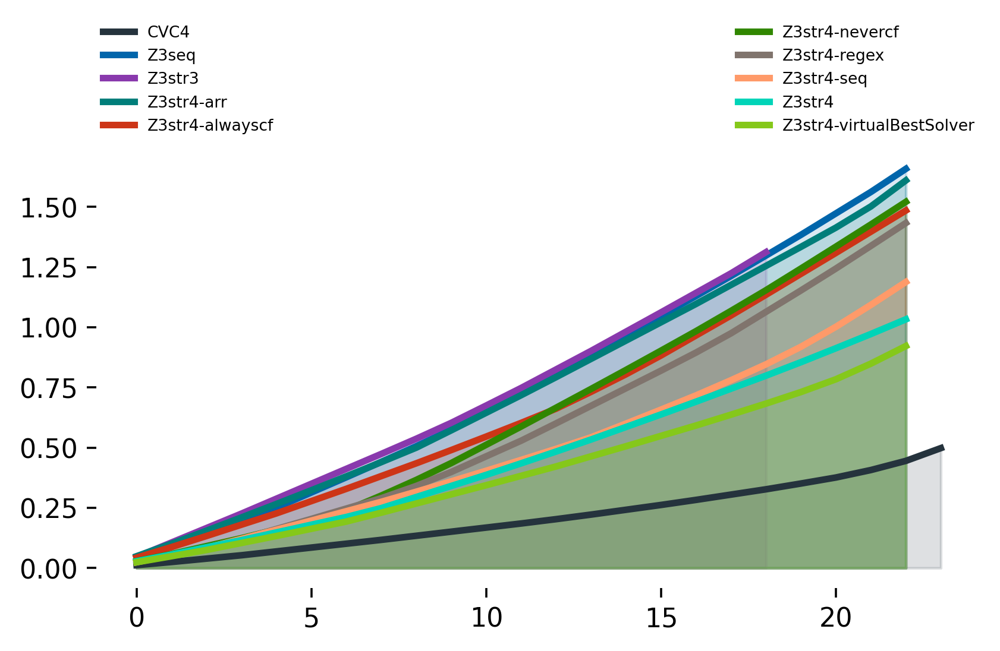

|===
|Solver |Cor. class. (contr.) |SAT |UNSAT |UNKN |ERR |CRA |TO |Par2 |Tot. inst. |Tot. inst. w/o TO | Tot. time |Tot. time w/o TO
|+++<span style="color: #25333D;font-weight: bold;">CVC4</span>+++|24 (0.11)|10|14|0|0|0|0|498|24|24|498|498
|+++<span style="color: #00D4B8;font-weight: bold;">Z3str4</span>+++|23 (0.0)|10|13|0|0|0|1|41033|24|23|21033|1033
|+++<span style="color: #FF9A69;font-weight: bold;">Z3str4-seq</span>+++|23 (0.0)|10|13|0|0|0|1|41188|24|23|21188|1188
|+++<span style="color: #80746D;font-weight: bold;">Z3str4-regex</span>+++|23 (0.0)|10|13|0|0|0|1|41433|24|23|21433|1433
|+++<span style="color: #CD3517;font-weight: bold;">Z3str4-alwayscf</span>+++|23 (0.0)|10|13|0|0|0|1|41485|24|23|21485|1485
|+++<span style="color: #318700;font-weight: bold;">Z3str4-nevercf</span>+++|23 (0.0)|10|13|0|0|0|1|41521|24|23|21521|1521
|+++<span style="color: #007E7A;font-weight: bold;">Z3str4-arr</span>+++|23 (0.0)|10|13|0|0|0|1|41610|24|23|21610|1610
|+++<span style="color: #0065AB;font-weight: bold;">Z3seq</span>+++|23 (0.0)|10|13|0|0|0|1|41658|24|23|21658|1658
|+++<span style="color: #8939AD;font-weight: bold;">Z3str3</span>+++|19 (0.0)|9|10|0|0|0|5|201312|24|19|101312|1312
|+++<span style="color: #85C81A;font-weight: bold;">Z3str4-virtualBestSolver</span>+++|23 (-)|10|13|0|0|0|1|40922|24|23|20922|922
|===

[NOTE]
====
+++<span style="color: #25333D;font-weight: bold;">CVC4</span>+++ had the biggest lead with 1.04 and +++<span style="color: #25333D;font-weight: bold;">CVC4</span>+++ hat the largest contribution with 0.11. Other solvers contributed as follows: +++<span style="color: #007E7A;font-weight: bold;">Z3str4-arr</span>+++: 0.0,+++<span style="color: #80746D;font-weight: bold;">Z3str4-regex</span>+++: 0.0,+++<span style="color: #318700;font-weight: bold;">Z3str4-nevercf</span>+++: 0.0,+++<span style="color: #8939AD;font-weight: bold;">Z3str3</span>+++: 0.0,+++<span style="color: #FF9A69;font-weight: bold;">Z3str4-seq</span>+++: 0.0,+++<span style="color: #CD3517;font-weight: bold;">Z3str4-alwayscf</span>+++: 0.0,+++<span style="color: #0065AB;font-weight: bold;">Z3seq</span>+++: 0.0,+++<span style="color: #00D4B8;font-weight: bold;">Z3str4</span>+++: 0.0.
====

=== Woorpje Word Equations


[.text-center]
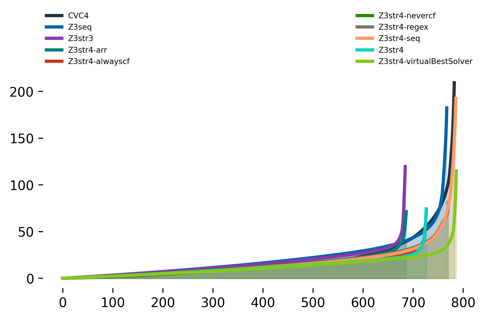

|===
|Solver |Cor. class. (contr.) |SAT |UNSAT |UNKN |ERR |CRA |TO |Par2 |Tot. inst. |Tot. inst. w/o TO | Tot. time |Tot. time w/o TO
|+++<span style="color: #FF9A69;font-weight: bold;">Z3str4-seq</span>+++|786 (0.23)|622|164|0|0|0|23|1112740|809|786|652740|192740
|+++<span style="color: #25333D;font-weight: bold;">CVC4</span>+++|783 (0.23)|619|164|0|0|0|26|1249396|809|783|729396|209396
|+++<span style="color: #0065AB;font-weight: bold;">Z3seq</span>+++|768 (0.0)|604|164|0|0|0|41|1822419|809|768|1002419|182419
|+++<span style="color: #CD3517;font-weight: bold;">Z3str4-alwayscf</span>+++|727 (0.0)|563|164|0|0|0|82|3353284|809|727|1713284|73284
|+++<span style="color: #00D4B8;font-weight: bold;">Z3str4</span>+++|727 (0.0)|563|164|0|0|0|82|3354318|809|727|1714318|74318
|+++<span style="color: #80746D;font-weight: bold;">Z3str4-regex</span>+++|771 (0.0)|607|166|8|2|0|28|1857227|809|781|697227|137227
|+++<span style="color: #318700;font-weight: bold;">Z3str4-nevercf</span>+++|771 (0.0)|607|167|8|3|0|27|1958551|809|782|678551|138551
|+++<span style="color: #007E7A;font-weight: bold;">Z3str4-arr</span>+++|687 (0.0)|523|172|11|8|0|103|5819968|809|706|2199968|139968
|+++<span style="color: #8939AD;font-weight: bold;">Z3str3</span>+++|685 (0.0)|522|171|14|8|0|102|5925016|809|707|2205016|165016
|+++<span style="color: #85C81A;font-weight: bold;">Z3str4-virtualBestSolver</span>+++|787 (-)|623|164|6|0|0|16|994883|809|793|471521|114883
|===

[NOTE]
====
+++<span style="color: #FF9A69;font-weight: bold;">Z3str4-seq</span>+++ had the biggest lead with 1.0 and +++<span style="color: #25333D;font-weight: bold;">CVC4</span>+++ hat the largest contribution with 0.23. Other solvers contributed as follows: +++<span style="color: #FF9A69;font-weight: bold;">Z3str4-seq</span>+++: 0.23,+++<span style="color: #007E7A;font-weight: bold;">Z3str4-arr</span>+++: 0.0,+++<span style="color: #80746D;font-weight: bold;">Z3str4-regex</span>+++: 0.0,+++<span style="color: #318700;font-weight: bold;">Z3str4-nevercf</span>+++: 0.0,+++<span style="color: #8939AD;font-weight: bold;">Z3str3</span>+++: 0.0,+++<span style="color: #CD3517;font-weight: bold;">Z3str4-alwayscf</span>+++: 0.0,+++<span style="color: #0065AB;font-weight: bold;">Z3seq</span>+++: 0.0,+++<span style="color: #00D4B8;font-weight: bold;">Z3str4</span>+++: 0.0.
====

=== Kaluza


[.text-center]
image::img_ALL/kaluza.png[cactus]

|===
|Solver |Cor. class. (contr.) |SAT |UNSAT |UNKN |ERR |CRA |TO |Par2 |Tot. inst. |Tot. inst. w/o TO | Tot. time |Tot. time w/o TO
|+++<span style="color: #007E7A;font-weight: bold;">Z3str4-arr</span>+++|46526 (0.45)|34539|11987|99|0|0|659|34304368|47284|46625|17164368|3984368
|+++<span style="color: #CD3517;font-weight: bold;">Z3str4-alwayscf</span>+++|46507 (0.0)|34519|11988|30|0|0|747|34737117|47284|46537|18597117|3657117
|+++<span style="color: #80746D;font-weight: bold;">Z3str4-regex</span>+++|46432 (6.16)|34446|11986|120|0|0|732|40174612|47284|46552|20734612|6094612
|+++<span style="color: #318700;font-weight: bold;">Z3str4-nevercf</span>+++|46422 (4.92)|34437|11985|134|0|0|728|40779971|47284|46556|20859971|6299971
|+++<span style="color: #8939AD;font-weight: bold;">Z3str3</span>+++|46102 (2.8)|34303|11799|215|0|0|967|51598350|47284|46317|23658350|4318350
|+++<span style="color: #00D4B8;font-weight: bold;">Z3str4</span>+++|45444 (0.67)|33458|11986|64|0|0|1776|79420496|47284|45508|41340496|5820496
|+++<span style="color: #0065AB;font-weight: bold;">Z3seq</span>+++|45431 (0.0)|33787|11644|0|0|0|1853|78476060|47284|45431|41416060|4356060
|+++<span style="color: #FF9A69;font-weight: bold;">Z3str4-seq</span>+++|45251 (0.0)|33452|11799|0|0|0|2033|86761363|47284|45251|46101363|5441363
|+++<span style="color: #25333D;font-weight: bold;">CVC4</span>+++|44215 (0.0)|32389|11826|0|0|0|3069|132038767|47284|44215|70658767|9278767
|+++<span style="color: #85C81A;font-weight: bold;">Z3str4-virtualBestSolver</span>+++|46862 (-)|34874|11988|139|0|0|283|20937152|47284|47001|10995496|4057152
|===

[NOTE]
====
+++<span style="color: #007E7A;font-weight: bold;">Z3str4-arr</span>+++ had the biggest lead with 1.0 and +++<span style="color: #80746D;font-weight: bold;">Z3str4-regex</span>+++ hat the largest contribution with 6.16. Other solvers contributed as follows: +++<span style="color: #318700;font-weight: bold;">Z3str4-nevercf</span>+++: 4.92,+++<span style="color: #8939AD;font-weight: bold;">Z3str3</span>+++: 2.8,+++<span style="color: #00D4B8;font-weight: bold;">Z3str4</span>+++: 0.67,+++<span style="color: #007E7A;font-weight: bold;">Z3str4-arr</span>+++: 0.45,+++<span style="color: #25333D;font-weight: bold;">CVC4</span>+++: 0.0,+++<span style="color: #FF9A69;font-weight: bold;">Z3str4-seq</span>+++: 0.0,+++<span style="color: #CD3517;font-weight: bold;">Z3str4-alwayscf</span>+++: 0.0,+++<span style="color: #0065AB;font-weight: bold;">Z3seq</span>+++: 0.0.
====

=== StringFuzz


[.text-center]
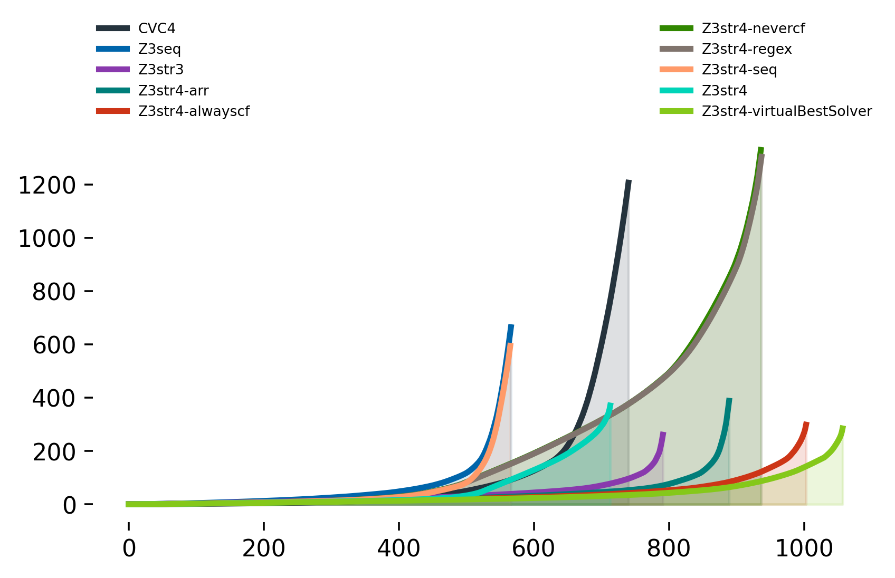

|===
|Solver |Cor. class. (contr.) |SAT |UNSAT |UNKN |ERR |CRA |TO |Par2 |Tot. inst. |Tot. inst. w/o TO | Tot. time |Tot. time w/o TO
|+++<span style="color: #CD3517;font-weight: bold;">Z3str4-alwayscf</span>+++|1004 (0.0)|702|302|0|0|0|61|2738984|1065|1004|1518984|298984
|+++<span style="color: #80746D;font-weight: bold;">Z3str4-regex</span>+++|938 (0.0)|715|223|17|0|0|110|6395416|1065|955|3515416|1315416
|+++<span style="color: #318700;font-weight: bold;">Z3str4-nevercf</span>+++|937 (0.0)|714|223|17|0|0|111|6460086|1065|954|3560086|1340086
|+++<span style="color: #007E7A;font-weight: bold;">Z3str4-arr</span>+++|890 (0.0)|662|228|0|0|0|175|7388595|1065|890|3888595|388595
|+++<span style="color: #8939AD;font-weight: bold;">Z3str3</span>+++|792 (0.0)|606|186|3|0|0|270|11181513|1065|795|5661513|261513
|+++<span style="color: #25333D;font-weight: bold;">CVC4</span>+++|741 (0.0)|490|251|0|0|0|324|14167509|1065|741|7687509|1207509
|+++<span style="color: #00D4B8;font-weight: bold;">Z3str4</span>+++|714 (0.0)|412|302|45|0|0|306|14595111|1065|759|6675111|555111
|+++<span style="color: #0065AB;font-weight: bold;">Z3seq</span>+++|567 (0.0)|354|213|43|0|0|455|20790128|1065|610|9970128|870128
|+++<span style="color: #FF9A69;font-weight: bold;">Z3str4-seq</span>+++|566 (0.0)|354|212|43|0|0|456|20714495|1065|609|9874495|754495
|+++<span style="color: #85C81A;font-weight: bold;">Z3str4-virtualBestSolver</span>+++|1058 (-)|756|302|0|0|0|7|564989|1065|1058|424989|284989
|===

[NOTE]
====
+++<span style="color: #CD3517;font-weight: bold;">Z3str4-alwayscf</span>+++ had the biggest lead with 1.07 and +++<span style="color: #007E7A;font-weight: bold;">Z3str4-arr</span>+++ hat the largest contribution with 0.0. Other solvers contributed as follows: +++<span style="color: #25333D;font-weight: bold;">CVC4</span>+++: 0.0,+++<span style="color: #80746D;font-weight: bold;">Z3str4-regex</span>+++: 0.0,+++<span style="color: #318700;font-weight: bold;">Z3str4-nevercf</span>+++: 0.0,+++<span style="color: #8939AD;font-weight: bold;">Z3str3</span>+++: 0.0,+++<span style="color: #FF9A69;font-weight: bold;">Z3str4-seq</span>+++: 0.0,+++<span style="color: #CD3517;font-weight: bold;">Z3str4-alwayscf</span>+++: 0.0,+++<span style="color: #0065AB;font-weight: bold;">Z3seq</span>+++: 0.0,+++<span style="color: #00D4B8;font-weight: bold;">Z3str4</span>+++: 0.0.
====

=== z3Str3 Regression


[.text-center]
image::img_ALL/z3str3regression.png[cactus]

|===
|Solver |Cor. class. (contr.) |SAT |UNSAT |UNKN |ERR |CRA |TO |Par2 |Tot. inst. |Tot. inst. w/o TO | Tot. time |Tot. time w/o TO
|+++<span style="color: #25333D;font-weight: bold;">CVC4</span>+++|242 (0.0)|196|46|0|0|0|0|6288|242|242|6288|6288
|+++<span style="color: #CD3517;font-weight: bold;">Z3str4-alwayscf</span>+++|242 (0.0)|196|46|0|0|0|0|12559|242|242|12559|12559
|+++<span style="color: #80746D;font-weight: bold;">Z3str4-regex</span>+++|242 (0.0)|196|46|0|0|0|0|19352|242|242|19352|19352
|+++<span style="color: #318700;font-weight: bold;">Z3str4-nevercf</span>+++|242 (0.0)|196|46|0|0|0|0|20729|242|242|20729|20729
|+++<span style="color: #8939AD;font-weight: bold;">Z3str3</span>+++|238 (0.0)|194|44|1|0|0|3|172650|242|239|72650|12650
|+++<span style="color: #007E7A;font-weight: bold;">Z3str4-arr</span>+++|238 (0.0)|192|46|0|0|0|4|170959|242|238|90959|10959
|+++<span style="color: #00D4B8;font-weight: bold;">Z3str4</span>+++|233 (0.0)|196|37|0|0|0|9|367287|242|233|187287|7287
|+++<span style="color: #FF9A69;font-weight: bold;">Z3str4-seq</span>+++|233 (0.0)|196|37|0|0|0|9|369399|242|233|189399|9399
|+++<span style="color: #0065AB;font-weight: bold;">Z3seq</span>+++|232 (0.0)|195|37|0|0|0|10|414648|242|232|214648|14648
|+++<span style="color: #85C81A;font-weight: bold;">Z3str4-virtualBestSolver</span>+++|242 (-)|196|46|0|0|0|0|8591|242|242|8591|8591
|===

[NOTE]
====
+++<span style="color: #25333D;font-weight: bold;">CVC4</span>+++ had the biggest lead with 1.0 and +++<span style="color: #007E7A;font-weight: bold;">Z3str4-arr</span>+++ hat the largest contribution with 0.0. Other solvers contributed as follows: +++<span style="color: #25333D;font-weight: bold;">CVC4</span>+++: 0.0,+++<span style="color: #80746D;font-weight: bold;">Z3str4-regex</span>+++: 0.0,+++<span style="color: #318700;font-weight: bold;">Z3str4-nevercf</span>+++: 0.0,+++<span style="color: #8939AD;font-weight: bold;">Z3str3</span>+++: 0.0,+++<span style="color: #FF9A69;font-weight: bold;">Z3str4-seq</span>+++: 0.0,+++<span style="color: #CD3517;font-weight: bold;">Z3str4-alwayscf</span>+++: 0.0,+++<span style="color: #0065AB;font-weight: bold;">Z3seq</span>+++: 0.0,+++<span style="color: #00D4B8;font-weight: bold;">Z3str4</span>+++: 0.0.
====

=== Cashew


[.text-center]
image::img_ALL/cashew.png[cactus]

|===
|Solver |Cor. class. (contr.) |SAT |UNSAT |UNKN |ERR |CRA |TO |Par2 |Tot. inst. |Tot. inst. w/o TO | Tot. time |Tot. time w/o TO
|+++<span style="color: #CD3517;font-weight: bold;">Z3str4-alwayscf</span>+++|394 (0.0)|382|12|0|0|0|0|16588|394|394|16588|16588
|+++<span style="color: #007E7A;font-weight: bold;">Z3str4-arr</span>+++|394 (0.0)|382|12|0|0|0|0|17067|394|394|17067|17067
|+++<span style="color: #00D4B8;font-weight: bold;">Z3str4</span>+++|394 (0.0)|382|12|0|0|0|0|22184|394|394|22184|22184
|+++<span style="color: #318700;font-weight: bold;">Z3str4-nevercf</span>+++|394 (0.0)|382|12|0|0|0|0|25939|394|394|25939|25939
|+++<span style="color: #8939AD;font-weight: bold;">Z3str3</span>+++|394 (0.0)|382|12|0|0|0|0|31303|394|394|31303|31303
|+++<span style="color: #80746D;font-weight: bold;">Z3str4-regex</span>+++|393 (0.0)|381|12|0|0|0|1|64193|394|393|44193|24193
|+++<span style="color: #FF9A69;font-weight: bold;">Z3str4-seq</span>+++|391 (0.0)|379|12|0|0|0|3|168054|394|391|108054|48054
|+++<span style="color: #0065AB;font-weight: bold;">Z3seq</span>+++|387 (0.0)|375|12|0|0|0|7|311243|394|387|171243|31243
|+++<span style="color: #25333D;font-weight: bold;">CVC4</span>+++|378 (0.0)|366|12|0|0|0|16|678968|394|378|358968|38968
|+++<span style="color: #85C81A;font-weight: bold;">Z3str4-virtualBestSolver</span>+++|394 (-)|382|12|0|0|0|0|13142|394|394|13142|13142
|===

[NOTE]
====
+++<span style="color: #CD3517;font-weight: bold;">Z3str4-alwayscf</span>+++ had the biggest lead with 1.0 and +++<span style="color: #007E7A;font-weight: bold;">Z3str4-arr</span>+++ hat the largest contribution with 0.0. Other solvers contributed as follows: +++<span style="color: #25333D;font-weight: bold;">CVC4</span>+++: 0.0,+++<span style="color: #80746D;font-weight: bold;">Z3str4-regex</span>+++: 0.0,+++<span style="color: #318700;font-weight: bold;">Z3str4-nevercf</span>+++: 0.0,+++<span style="color: #8939AD;font-weight: bold;">Z3str3</span>+++: 0.0,+++<span style="color: #FF9A69;font-weight: bold;">Z3str4-seq</span>+++: 0.0,+++<span style="color: #CD3517;font-weight: bold;">Z3str4-alwayscf</span>+++: 0.0,+++<span style="color: #0065AB;font-weight: bold;">Z3seq</span>+++: 0.0,+++<span style="color: #00D4B8;font-weight: bold;">Z3str4</span>+++: 0.0.
====

=== JOACO


[.text-center]
image::img_ALL/joaco.png[cactus]

|===
|Solver |Cor. class. (contr.) |SAT |UNSAT |UNKN |ERR |CRA |TO |Par2 |Tot. inst. |Tot. inst. w/o TO | Tot. time |Tot. time w/o TO
|+++<span style="color: #25333D;font-weight: bold;">CVC4</span>+++|94 (0.0)|73|21|0|0|0|0|10979|94|94|10979|10979
|+++<span style="color: #00D4B8;font-weight: bold;">Z3str4</span>+++|94 (0.0)|73|21|0|0|0|0|31331|94|94|31331|31331
|+++<span style="color: #80746D;font-weight: bold;">Z3str4-regex</span>+++|94 (0.0)|73|21|0|0|0|0|31381|94|94|31381|31381
|+++<span style="color: #318700;font-weight: bold;">Z3str4-nevercf</span>+++|94 (0.0)|73|21|0|0|0|0|31548|94|94|31548|31548
|+++<span style="color: #FF9A69;font-weight: bold;">Z3str4-seq</span>+++|94 (0.0)|73|21|0|0|0|0|62700|94|94|62700|62700
|+++<span style="color: #0065AB;font-weight: bold;">Z3seq</span>+++|94 (0.0)|73|21|0|0|0|0|67521|94|94|67521|67521
|+++<span style="color: #007E7A;font-weight: bold;">Z3str4-arr</span>+++|37 (0.0)|17|20|57|0|0|0|2284465|94|94|4465|4465
|+++<span style="color: #CD3517;font-weight: bold;">Z3str4-alwayscf</span>+++|37 (0.0)|17|20|57|0|0|0|2285500|94|94|5500|5500
|+++<span style="color: #8939AD;font-weight: bold;">Z3str3</span>+++|37 (0.0)|17|20|57|0|0|0|2285867|94|94|5867|5867
|+++<span style="color: #85C81A;font-weight: bold;">Z3str4-virtualBestSolver</span>+++|94 (-)|73|21|0|0|0|0|14374|94|94|14374|14374
|===

[NOTE]
====
+++<span style="color: #25333D;font-weight: bold;">CVC4</span>+++ had the biggest lead with 1.0 and +++<span style="color: #007E7A;font-weight: bold;">Z3str4-arr</span>+++ hat the largest contribution with 0.0. Other solvers contributed as follows: +++<span style="color: #25333D;font-weight: bold;">CVC4</span>+++: 0.0,+++<span style="color: #80746D;font-weight: bold;">Z3str4-regex</span>+++: 0.0,+++<span style="color: #318700;font-weight: bold;">Z3str4-nevercf</span>+++: 0.0,+++<span style="color: #8939AD;font-weight: bold;">Z3str3</span>+++: 0.0,+++<span style="color: #FF9A69;font-weight: bold;">Z3str4-seq</span>+++: 0.0,+++<span style="color: #CD3517;font-weight: bold;">Z3str4-alwayscf</span>+++: 0.0,+++<span style="color: #0065AB;font-weight: bold;">Z3seq</span>+++: 0.0,+++<span style="color: #00D4B8;font-weight: bold;">Z3str4</span>+++: 0.0.
====

=== Stranger


[.text-center]
image::img_ALL/stranger.png[cactus]

|===
|Solver |Cor. class. (contr.) |SAT |UNSAT |UNKN |ERR |CRA |TO |Par2 |Tot. inst. |Tot. inst. w/o TO | Tot. time |Tot. time w/o TO
|+++<span style="color: #8939AD;font-weight: bold;">Z3str3</span>+++|4 (0.0)|4|0|0|0|0|0|246|4|4|246|246
|+++<span style="color: #007E7A;font-weight: bold;">Z3str4-arr</span>+++|4 (0.0)|4|0|0|0|0|0|294|4|4|294|294
|+++<span style="color: #CD3517;font-weight: bold;">Z3str4-alwayscf</span>+++|4 (0.0)|4|0|0|0|0|0|338|4|4|338|338
|+++<span style="color: #25333D;font-weight: bold;">CVC4</span>+++|4 (0.0)|4|0|0|0|0|0|677|4|4|677|677
|+++<span style="color: #318700;font-weight: bold;">Z3str4-nevercf</span>+++|4 (0.0)|4|0|0|0|0|0|4315|4|4|4315|4315
|+++<span style="color: #80746D;font-weight: bold;">Z3str4-regex</span>+++|4 (0.0)|4|0|0|0|0|0|4315|4|4|4315|4315
|+++<span style="color: #00D4B8;font-weight: bold;">Z3str4</span>+++|4 (0.0)|4|0|0|0|0|0|4317|4|4|4317|4317
|+++<span style="color: #0065AB;font-weight: bold;">Z3seq</span>+++|4 (0.0)|4|0|0|0|0|0|9745|4|4|9745|9745
|+++<span style="color: #FF9A69;font-weight: bold;">Z3str4-seq</span>+++|4 (0.0)|4|0|0|0|0|0|10721|4|4|10721|10721
|+++<span style="color: #85C81A;font-weight: bold;">Z3str4-virtualBestSolver</span>+++|4 (-)|4|0|0|0|0|0|338|4|4|338|338
|===

[NOTE]
====
+++<span style="color: #8939AD;font-weight: bold;">Z3str3</span>+++ had the biggest lead with 1.0 and +++<span style="color: #007E7A;font-weight: bold;">Z3str4-arr</span>+++ hat the largest contribution with 0.0. Other solvers contributed as follows: +++<span style="color: #25333D;font-weight: bold;">CVC4</span>+++: 0.0,+++<span style="color: #80746D;font-weight: bold;">Z3str4-regex</span>+++: 0.0,+++<span style="color: #318700;font-weight: bold;">Z3str4-nevercf</span>+++: 0.0,+++<span style="color: #8939AD;font-weight: bold;">Z3str3</span>+++: 0.0,+++<span style="color: #FF9A69;font-weight: bold;">Z3str4-seq</span>+++: 0.0,+++<span style="color: #CD3517;font-weight: bold;">Z3str4-alwayscf</span>+++: 0.0,+++<span style="color: #0065AB;font-weight: bold;">Z3seq</span>+++: 0.0,+++<span style="color: #00D4B8;font-weight: bold;">Z3str4</span>+++: 0.0.
====

=== Kausler


[.text-center]
image::img_ALL/kausler.png[cactus]

|===
|Solver |Cor. class. (contr.) |SAT |UNSAT |UNKN |ERR |CRA |TO |Par2 |Tot. inst. |Tot. inst. w/o TO | Tot. time |Tot. time w/o TO
|+++<span style="color: #0065AB;font-weight: bold;">Z3seq</span>+++|118 (0.11)|118|0|0|0|0|2|108625|120|118|68625|28625
|+++<span style="color: #FF9A69;font-weight: bold;">Z3str4-seq</span>+++|117 (0.0)|117|0|0|0|0|3|157238|120|117|97238|37238
|+++<span style="color: #25333D;font-weight: bold;">CVC4</span>+++|117 (0.0)|117|0|0|0|0|3|161353|120|117|101353|41353
|+++<span style="color: #80746D;font-weight: bold;">Z3str4-regex</span>+++|115 (0.0)|115|0|0|0|0|5|256434|120|115|156434|56434
|+++<span style="color: #318700;font-weight: bold;">Z3str4-nevercf</span>+++|115 (0.0)|115|0|0|0|0|5|256676|120|115|156676|56676
|+++<span style="color: #8939AD;font-weight: bold;">Z3str3</span>+++|99 (0.0)|99|0|0|0|0|21|846127|120|99|426127|6127
|+++<span style="color: #007E7A;font-weight: bold;">Z3str4-arr</span>+++|79 (0.0)|79|0|5|0|0|36|1772295|120|84|852295|132295
|+++<span style="color: #00D4B8;font-weight: bold;">Z3str4</span>+++|78 (0.0)|78|0|7|0|0|35|1845602|120|85|865602|165602
|+++<span style="color: #CD3517;font-weight: bold;">Z3str4-alwayscf</span>+++|78 (0.0)|78|0|7|0|0|35|1855913|120|85|875913|175913
|+++<span style="color: #85C81A;font-weight: bold;">Z3str4-virtualBestSolver</span>+++|117 (-)|117|0|0|0|0|3|156744|120|117|96744|36744
|===

[NOTE]
====
+++<span style="color: #0065AB;font-weight: bold;">Z3seq</span>+++ had the biggest lead with 1.01 and +++<span style="color: #0065AB;font-weight: bold;">Z3seq</span>+++ hat the largest contribution with 0.11. Other solvers contributed as follows: +++<span style="color: #007E7A;font-weight: bold;">Z3str4-arr</span>+++: 0.0,+++<span style="color: #25333D;font-weight: bold;">CVC4</span>+++: 0.0,+++<span style="color: #80746D;font-weight: bold;">Z3str4-regex</span>+++: 0.0,+++<span style="color: #318700;font-weight: bold;">Z3str4-nevercf</span>+++: 0.0,+++<span style="color: #8939AD;font-weight: bold;">Z3str3</span>+++: 0.0,+++<span style="color: #FF9A69;font-weight: bold;">Z3str4-seq</span>+++: 0.0,+++<span style="color: #CD3517;font-weight: bold;">Z3str4-alwayscf</span>+++: 0.0,+++<span style="color: #00D4B8;font-weight: bold;">Z3str4</span>+++: 0.0.
====

=== BanditFuzz


[.text-center]
image::img_ALL/banditfuzz.png[cactus]

|===
|Solver |Cor. class. (contr.) |SAT |UNSAT |UNKN |ERR |CRA |TO |Par2 |Tot. inst. |Tot. inst. w/o TO | Tot. time |Tot. time w/o TO
|+++<span style="color: #25333D;font-weight: bold;">CVC4</span>+++|346 (0.78)|63|283|0|0|0|11|561044|357|346|341044|121044
|+++<span style="color: #318700;font-weight: bold;">Z3str4-nevercf</span>+++|343 (0.0)|51|292|0|0|0|14|586328|357|343|306328|26328
|+++<span style="color: #00D4B8;font-weight: bold;">Z3str4</span>+++|343 (0.0)|53|290|0|0|0|14|592769|357|343|312769|32769
|+++<span style="color: #80746D;font-weight: bold;">Z3str4-regex</span>+++|341 (0.0)|49|292|0|0|0|16|661688|357|341|341688|21688
|+++<span style="color: #FF9A69;font-weight: bold;">Z3str4-seq</span>+++|341 (0.0)|51|290|1|0|0|15|686748|357|342|346748|46748
|+++<span style="color: #0065AB;font-weight: bold;">Z3seq</span>+++|338 (0.0)|47|291|0|0|0|19|822453|357|338|442453|62453
|+++<span style="color: #CD3517;font-weight: bold;">Z3str4-alwayscf</span>+++|310 (0.0)|25|285|5|0|0|42|1922081|357|315|882081|42081
|+++<span style="color: #8939AD;font-weight: bold;">Z3str3</span>+++|307 (0.0)|20|287|0|0|0|50|2052628|357|307|1052628|52628
|+++<span style="color: #007E7A;font-weight: bold;">Z3str4-arr</span>+++|299 (0.0)|14|285|5|0|0|53|2371549|357|304|1111549|51549
|+++<span style="color: #85C81A;font-weight: bold;">Z3str4-virtualBestSolver</span>+++|347 (-)|55|292|1|0|0|9|436301|357|348|233599|36301
|===

[NOTE]
====
+++<span style="color: #25333D;font-weight: bold;">CVC4</span>+++ had the biggest lead with 1.01 and +++<span style="color: #25333D;font-weight: bold;">CVC4</span>+++ hat the largest contribution with 0.78. Other solvers contributed as follows: +++<span style="color: #007E7A;font-weight: bold;">Z3str4-arr</span>+++: 0.0,+++<span style="color: #80746D;font-weight: bold;">Z3str4-regex</span>+++: 0.0,+++<span style="color: #318700;font-weight: bold;">Z3str4-nevercf</span>+++: 0.0,+++<span style="color: #8939AD;font-weight: bold;">Z3str3</span>+++: 0.0,+++<span style="color: #FF9A69;font-weight: bold;">Z3str4-seq</span>+++: 0.0,+++<span style="color: #CD3517;font-weight: bold;">Z3str4-alwayscf</span>+++: 0.0,+++<span style="color: #0065AB;font-weight: bold;">Z3seq</span>+++: 0.0,+++<span style="color: #00D4B8;font-weight: bold;">Z3str4</span>+++: 0.0.
====

=== automatark25


[.text-center]
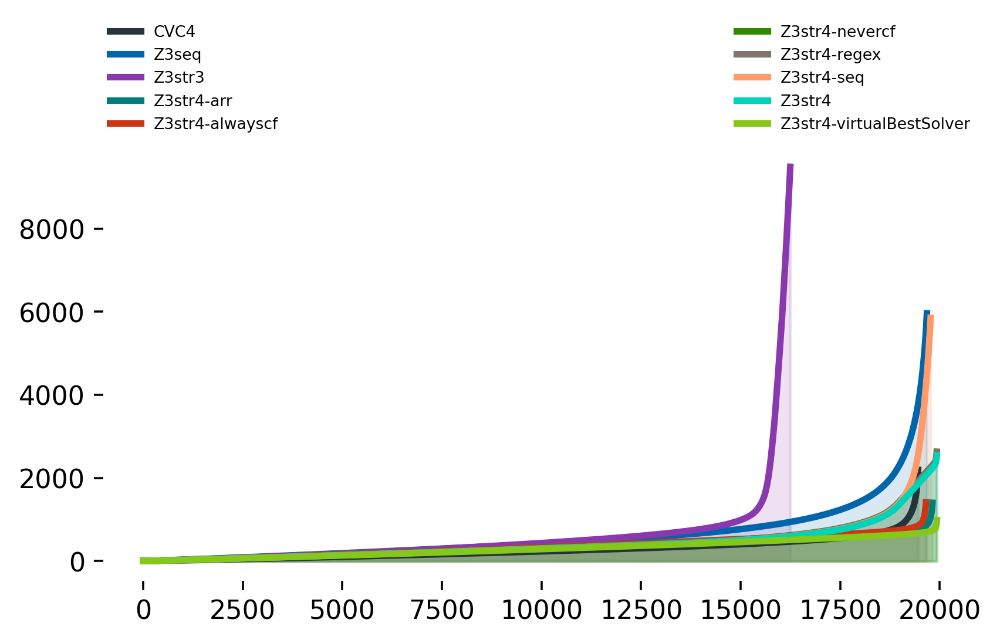

|===
|Solver |Cor. class. (contr.) |SAT |UNSAT |UNKN |ERR |CRA |TO |Par2 |Tot. inst. |Tot. inst. w/o TO | Tot. time |Tot. time w/o TO
|+++<span style="color: #00D4B8;font-weight: bold;">Z3str4</span>+++|19925 (0.0)|14465|5460|0|0|0|54|4703025|19979|19925|3623025|2543025
|+++<span style="color: #80746D;font-weight: bold;">Z3str4-regex</span>+++|19925 (0.0)|14465|5460|0|0|0|54|4783855|19979|19925|3703855|2623855
|+++<span style="color: #318700;font-weight: bold;">Z3str4-nevercf</span>+++|19925 (0.0)|14465|5460|0|0|0|54|4790189|19979|19925|3710189|2630189
|+++<span style="color: #007E7A;font-weight: bold;">Z3str4-arr</span>+++|19816 (0.0)|14437|5379|0|0|0|163|7921911|19979|19816|4661911|1401911
|+++<span style="color: #FF9A69;font-weight: bold;">Z3str4-seq</span>+++|19771 (0.0)|14362|5409|0|0|0|208|14172592|19979|19771|10012592|5852592
|+++<span style="color: #0065AB;font-weight: bold;">Z3seq</span>+++|19677 (0.0)|14344|5333|5|0|0|297|18048226|19979|19682|11908226|5968226
|+++<span style="color: #25333D;font-weight: bold;">CVC4</span>+++|19456 (3.34)|14166|5290|0|0|0|523|23113768|19979|19456|12653768|2193768
|+++<span style="color: #8939AD;font-weight: bold;">Z3str3</span>+++|16247 (0.11)|11836|4411|431|0|0|3301|158825397|19979|16678|75565397|9545397
|+++<span style="color: #CD3517;font-weight: bold;">Z3str4-alwayscf</span>+++|19652 (0.0)|14373|5280|240|1|96|86|14717002|19979|19893|3257002|1537002
|+++<span style="color: #85C81A;font-weight: bold;">Z3str4-virtualBestSolver</span>+++|19930 (-)|14468|5462|35|0|0|14|2946679|19979|19965|1292662|986679
|===

[NOTE]
====
+++<span style="color: #00D4B8;font-weight: bold;">Z3str4</span>+++ had the biggest lead with 1.0 and +++<span style="color: #25333D;font-weight: bold;">CVC4</span>+++ hat the largest contribution with 3.34. Other solvers contributed as follows: +++<span style="color: #8939AD;font-weight: bold;">Z3str3</span>+++: 0.11,+++<span style="color: #007E7A;font-weight: bold;">Z3str4-arr</span>+++: 0.0,+++<span style="color: #80746D;font-weight: bold;">Z3str4-regex</span>+++: 0.0,+++<span style="color: #318700;font-weight: bold;">Z3str4-nevercf</span>+++: 0.0,+++<span style="color: #FF9A69;font-weight: bold;">Z3str4-seq</span>+++: 0.0,+++<span style="color: #CD3517;font-weight: bold;">Z3str4-alwayscf</span>+++: 0.0,+++<span style="color: #0065AB;font-weight: bold;">Z3seq</span>+++: 0.0,+++<span style="color: #00D4B8;font-weight: bold;">Z3str4</span>+++: 0.0.
====

=== stringfuzzregexgenerated


[.text-center]
image::img_ALL/stringfuzzregexgenerated.png[cactus]

|===
|Solver |Cor. class. (contr.) |SAT |UNSAT |UNKN |ERR |CRA |TO |Par2 |Tot. inst. |Tot. inst. w/o TO | Tot. time |Tot. time w/o TO
|+++<span style="color: #00D4B8;font-weight: bold;">Z3str4</span>+++|4114 (0.0)|3284|830|10|0|0|46|8199002|4170|4124|6879002|5959002
|+++<span style="color: #80746D;font-weight: bold;">Z3str4-regex</span>+++|4114 (0.0)|3284|830|5|0|0|51|8535619|4170|4119|7315619|6295619
|+++<span style="color: #007E7A;font-weight: bold;">Z3str4-arr</span>+++|4111 (0.0)|3281|830|10|0|0|49|5705209|4170|4121|4325209|3345209
|+++<span style="color: #318700;font-weight: bold;">Z3str4-nevercf</span>+++|4107 (0.0)|3277|830|11|0|0|52|8680432|4170|4118|7200432|6160432
|+++<span style="color: #CD3517;font-weight: bold;">Z3str4-alwayscf</span>+++|4104 (0.0)|3274|830|11|0|0|55|7042785|4170|4115|5502785|4402785
|+++<span style="color: #8939AD;font-weight: bold;">Z3str3</span>+++|3316 (0.0)|3284|32|0|0|0|854|37633604|4170|3316|20553604|3473604
|+++<span style="color: #FF9A69;font-weight: bold;">Z3str4-seq</span>+++|2211 (0.11)|1514|697|0|0|0|1959|84287950|4170|2211|45107950|5927950
|+++<span style="color: #0065AB;font-weight: bold;">Z3seq</span>+++|2172 (0.0)|1475|697|0|0|0|1998|85618191|4170|2172|45658191|5698191
|+++<span style="color: #25333D;font-weight: bold;">CVC4</span>+++|1290 (0.0)|835|455|39|0|0|2841|119233019|4170|1329|60853892|4033019
|+++<span style="color: #85C81A;font-weight: bold;">Z3str4-virtualBestSolver</span>+++|4126 (-)|3296|830|0|0|0|44|5691736|4170|4126|4811736|3931736
|===

[NOTE]
====
+++<span style="color: #00D4B8;font-weight: bold;">Z3str4</span>+++ had the biggest lead with 1.0 and +++<span style="color: #FF9A69;font-weight: bold;">Z3str4-seq</span>+++ hat the largest contribution with 0.11. Other solvers contributed as follows: +++<span style="color: #007E7A;font-weight: bold;">Z3str4-arr</span>+++: 0.0,+++<span style="color: #25333D;font-weight: bold;">CVC4</span>+++: 0.0,+++<span style="color: #80746D;font-weight: bold;">Z3str4-regex</span>+++: 0.0,+++<span style="color: #318700;font-weight: bold;">Z3str4-nevercf</span>+++: 0.0,+++<span style="color: #8939AD;font-weight: bold;">Z3str3</span>+++: 0.0,+++<span style="color: #CD3517;font-weight: bold;">Z3str4-alwayscf</span>+++: 0.0,+++<span style="color: #0065AB;font-weight: bold;">Z3seq</span>+++: 0.0,+++<span style="color: #00D4B8;font-weight: bold;">Z3str4</span>+++: 0.0.
====

=== stringfuzzregextransformed


[.text-center]
image::img_ALL/stringfuzzregextransformed.png[cactus]

|===
|Solver |Cor. class. (contr.) |SAT |UNSAT |UNKN |ERR |CRA |TO |Par2 |Tot. inst. |Tot. inst. w/o TO | Tot. time |Tot. time w/o TO
|+++<span style="color: #00D4B8;font-weight: bold;">Z3str4</span>+++|10679 (0.0)|4631|6048|0|0|0|3|597563|10682|10679|537563|477563
|+++<span style="color: #318700;font-weight: bold;">Z3str4-nevercf</span>+++|10679 (0.0)|4631|6048|0|0|0|3|602193|10682|10679|542193|482193
|+++<span style="color: #80746D;font-weight: bold;">Z3str4-regex</span>+++|10679 (0.0)|4631|6048|0|0|0|3|608912|10682|10679|548912|488912
|+++<span style="color: #FF9A69;font-weight: bold;">Z3str4-seq</span>+++|10673 (0.0)|4630|6043|0|0|0|9|890089|10682|10673|710089|530089
|+++<span style="color: #CD3517;font-weight: bold;">Z3str4-alwayscf</span>+++|10646 (0.0)|4605|6041|15|0|8|21|1786210|10682|10661|766210|346210
|+++<span style="color: #25333D;font-weight: bold;">CVC4</span>+++|10643 (0.33)|4621|6022|0|0|0|39|1970815|10682|10643|1190815|410815
|+++<span style="color: #007E7A;font-weight: bold;">Z3str4-arr</span>+++|10639 (0.0)|4598|6041|6|0|0|37|2031029|10682|10645|1051029|311029
|+++<span style="color: #0065AB;font-weight: bold;">Z3seq</span>+++|10619 (0.0)|4628|5991|0|0|0|63|3171244|10682|10619|1911244|651244
|+++<span style="color: #8939AD;font-weight: bold;">Z3str3</span>+++|9242 (0.0)|4346|4896|1|0|0|1439|58348049|10682|9243|29528049|748049
|+++<span style="color: #85C81A;font-weight: bold;">Z3str4-virtualBestSolver</span>+++|10679 (-)|4631|6048|0|0|0|3|420936|10682|10679|360936|300936
|===

[NOTE]
====
+++<span style="color: #00D4B8;font-weight: bold;">Z3str4</span>+++ had the biggest lead with 1.0 and +++<span style="color: #25333D;font-weight: bold;">CVC4</span>+++ hat the largest contribution with 0.33. Other solvers contributed as follows: +++<span style="color: #007E7A;font-weight: bold;">Z3str4-arr</span>+++: 0.0,+++<span style="color: #80746D;font-weight: bold;">Z3str4-regex</span>+++: 0.0,+++<span style="color: #318700;font-weight: bold;">Z3str4-nevercf</span>+++: 0.0,+++<span style="color: #8939AD;font-weight: bold;">Z3str3</span>+++: 0.0,+++<span style="color: #FF9A69;font-weight: bold;">Z3str4-seq</span>+++: 0.0,+++<span style="color: #CD3517;font-weight: bold;">Z3str4-alwayscf</span>+++: 0.0,+++<span style="color: #0065AB;font-weight: bold;">Z3seq</span>+++: 0.0,+++<span style="color: #00D4B8;font-weight: bold;">Z3str4</span>+++: 0.0.
====

=== Total


[.text-center]
image::img_ALL/total.png[cactus]

|===
|Solver |Cor. class. (contr.) |SAT |UNSAT |UNKN |ERR |CRA |TO |Par2 |Tot. inst. |Tot. inst. w/o TO | Tot. time |Tot. time w/o TO
|+++<span style="color: #00D4B8;font-weight: bold;">Z3str4</span>+++|116439 (2.35)|71842|44597|170|0|0|3757|189396964|120366|116609|107456964|32316964
|+++<span style="color: #FF9A69;font-weight: bold;">Z3str4-seq</span>+++|113841 (1.01)|69807|44034|89|0|0|6436|296807036|120366|113930|164527036|35807036
|+++<span style="color: #0065AB;font-weight: bold;">Z3seq</span>+++|113636 (3.7)|69853|43783|50|0|0|6680|311734056|120366|113686|176134056|42534056
|+++<span style="color: #25333D;font-weight: bold;">CVC4</span>+++|112283 (48.93)|68386|43897|40|0|0|8043|350400148|120366|112323|187941021|27080148
|+++<span style="color: #CD3517;font-weight: bold;">Z3str4-alwayscf</span>+++|108534 (22.73)|64272|44263|2527|1|249|9304|489955374|120366|111062|202655374|16575374
|+++<span style="color: #80746D;font-weight: bold;">Z3str4-regex</span>+++|115182 (7.28)|70660|44524|247|2|0|4935|230066118|120366|115431|121206118|22506118
|+++<span style="color: #318700;font-weight: bold;">Z3str4-nevercf</span>+++|115118 (5.37)|70587|44534|260|3|0|4985|232687324|120366|115381|122167324|22467324
|+++<span style="color: #007E7A;font-weight: bold;">Z3str4-arr</span>+++|107401 (1.01)|63095|44314|525|8|0|12432|532807893|120366|107934|262047893|13407893
|+++<span style="color: #8939AD;font-weight: bold;">Z3str3</span>+++|100852 (3.58)|59663|41198|949|9|0|18556|801719159|120366|101810|391379159|20259159
|+++<span style="color: #85C81A;font-weight: bold;">Z3str4-virtualBestSolver</span>+++|118671 (-)|74012|44659|454|0|0|1241|91643007|120366|119125|50996414|23843007
|===

[NOTE]
====
+++<span style="color: #00D4B8;font-weight: bold;">Z3str4</span>+++ had the biggest lead with 1.02 and +++<span style="color: #25333D;font-weight: bold;">CVC4</span>+++ hat the largest contribution with 48.93. Other solvers contributed as follows: +++<span style="color: #CD3517;font-weight: bold;">Z3str4-alwayscf</span>+++: 22.73,+++<span style="color: #80746D;font-weight: bold;">Z3str4-regex</span>+++: 7.28,+++<span style="color: #318700;font-weight: bold;">Z3str4-nevercf</span>+++: 5.37,+++<span style="color: #0065AB;font-weight: bold;">Z3seq</span>+++: 3.7,+++<span style="color: #8939AD;font-weight: bold;">Z3str3</span>+++: 3.58,+++<span style="color: #00D4B8;font-weight: bold;">Z3str4</span>+++: 2.35,+++<span style="color: #007E7A;font-weight: bold;">Z3str4-arr</span>+++: 1.01,+++<span style="color: #FF9A69;font-weight: bold;">Z3str4-seq</span>+++: 1.01.
====

== Fragment Experiment
=== RegexFragment


[.text-center]
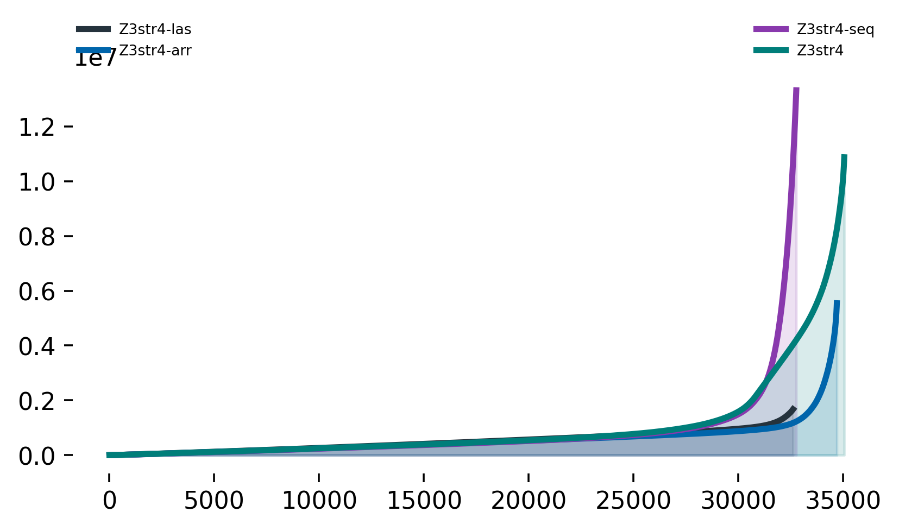

|===
|Solver |Cor. class. (contr.) |SAT |UNSAT |UNKN |ERR |CRA |TO |Par2 |Tot. inst. |Tot. inst. w/o TO | Tot. time |Tot. time w/o TO
|+++<span style="color: #007E7A;font-weight: bold;">Z3str4</span>+++|35046 (3.77)|22840|12206|9|0|0|290|10914204|35345|35055|16702244|10902244
|+++<span style="color: #0065AB;font-weight: bold;">Z3str4-arr</span>+++|34692 (4.03)|22632|12060|73|0|0|580|5596872|35345|34765|17170752|5570752
|+++<span style="color: #8939AD;font-weight: bold;">Z3str4-seq</span>+++|32758 (13.33)|20767|11991|9|0|0|2578|13525831|35345|32767|64982351|13422351
|+++<span style="color: #25333D;font-weight: bold;">Z3str4-las</span>+++|32603 (1.51)|20762|11842|2727|1|117|14|3807951|35345|35331|3978171|3698171
|===

[NOTE]
====
+++<span style="color: #007E7A;font-weight: bold;">Z3str4</span>+++ had the biggest lead with 1.01 and +++<span style="color: #8939AD;font-weight: bold;">Z3str4-seq</span>+++ hat the largest contribution with 13.33. Other solvers contributed as follows: +++<span style="color: #0065AB;font-weight: bold;">Z3str4-arr</span>+++: 4.03,+++<span style="color: #007E7A;font-weight: bold;">Z3str4</span>+++: 3.77,+++<span style="color: #25333D;font-weight: bold;">Z3str4-las</span>+++: 1.51.
====

=== SeqFragment


[.text-center]
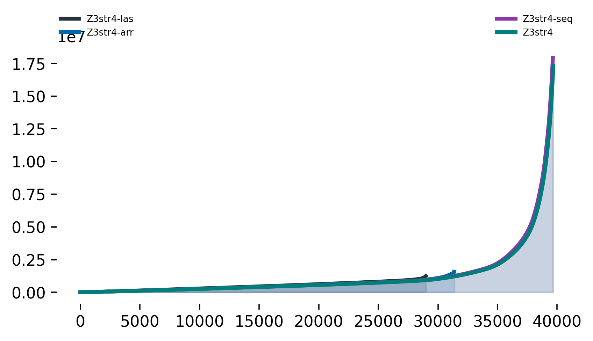

|===
|Solver |Cor. class. (contr.) |SAT |UNSAT |UNKN |ERR |CRA |TO |Par2 |Tot. inst. |Tot. inst. w/o TO | Tot. time |Tot. time w/o TO
|+++<span style="color: #007E7A;font-weight: bold;">Z3str4</span>+++|39680 (7.71)|23227|16453|87|0|0|2755|18104566|42522|39767|73090886|17990886
|+++<span style="color: #8939AD;font-weight: bold;">Z3str4-seq</span>+++|39639 (0.77)|23187|16452|83|0|0|2800|18680405|42522|39722|74565085|18565085
|+++<span style="color: #0065AB;font-weight: bold;">Z3str4-arr</span>+++|31376 (303.68)|14937|16439|314|0|0|10832|3882773|42522|31690|220076933|3436933
|+++<span style="color: #25333D;font-weight: bold;">Z3str4-las</span>+++|28990 (65.26)|13185|15805|13532|0|141|0|12629361|42522|42522|12088081|12088081
|===

[NOTE]
====
+++<span style="color: #007E7A;font-weight: bold;">Z3str4</span>+++ had the biggest lead with 1.0 and +++<span style="color: #0065AB;font-weight: bold;">Z3str4-arr</span>+++ hat the largest contribution with 303.68. Other solvers contributed as follows: +++<span style="color: #25333D;font-weight: bold;">Z3str4-las</span>+++: 65.26,+++<span style="color: #007E7A;font-weight: bold;">Z3str4</span>+++: 7.71,+++<span style="color: #8939AD;font-weight: bold;">Z3str4-seq</span>+++: 0.77.
====

=== ConjunctiveFragment


[.text-center]
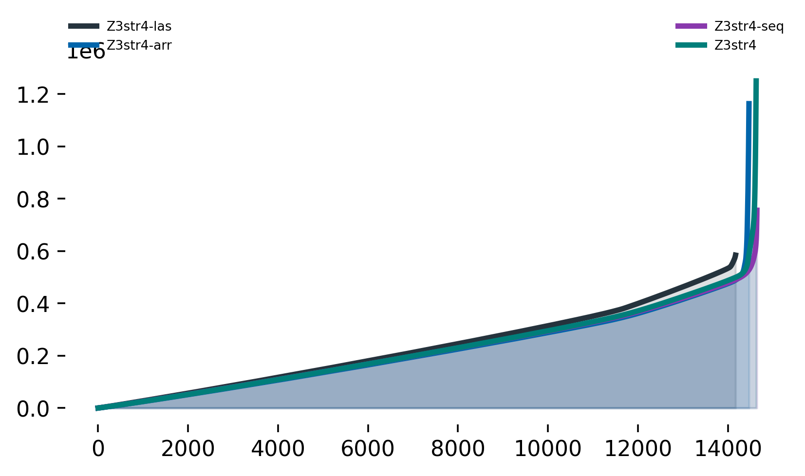

|===
|Solver |Cor. class. (contr.) |SAT |UNSAT |UNKN |ERR |CRA |TO |Par2 |Tot. inst. |Tot. inst. w/o TO | Tot. time |Tot. time w/o TO
|+++<span style="color: #8939AD;font-weight: bold;">Z3str4-seq</span>+++|14647 (37.95)|12115|2532|1|0|0|465|774663|15113|14648|10056023|756023
|+++<span style="color: #007E7A;font-weight: bold;">Z3str4</span>+++|14631 (3.57)|11954|2677|13|0|0|469|1338043|15113|14644|10698763|1318763
|+++<span style="color: #25333D;font-weight: bold;">Z3str4-las</span>+++|14172 (0.0)|11693|2479|941|0|0|0|1127231|15113|15113|1089591|1089591
|+++<span style="color: #0065AB;font-weight: bold;">Z3str4-arr</span>+++|14471 (3.82)|11887|2592|90|8|0|544|1702357|15113|14569|12555877|1675877
|===

[NOTE]
====
+++<span style="color: #8939AD;font-weight: bold;">Z3str4-seq</span>+++ had the biggest lead with 1.0 and +++<span style="color: #8939AD;font-weight: bold;">Z3str4-seq</span>+++ hat the largest contribution with 37.95. Other solvers contributed as follows: +++<span style="color: #0065AB;font-weight: bold;">Z3str4-arr</span>+++: 3.82,+++<span style="color: #007E7A;font-weight: bold;">Z3str4</span>+++: 3.57,+++<span style="color: #25333D;font-weight: bold;">Z3str4-las</span>+++: 0.0.
====

=== NonConjFragment


[.text-center]
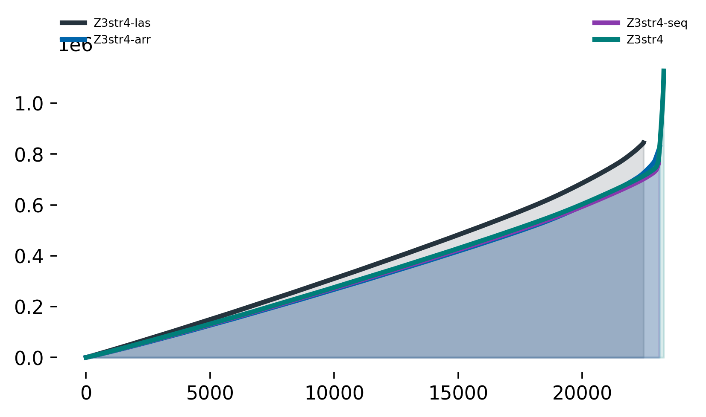

|===
|Solver |Cor. class. (contr.) |SAT |UNSAT |UNKN |ERR |CRA |TO |Par2 |Tot. inst. |Tot. inst. w/o TO | Tot. time |Tot. time w/o TO
|+++<span style="color: #007E7A;font-weight: bold;">Z3str4</span>+++|23286 (1.27)|13749|9537|68|0|0|289|1813757|23643|23354|7579477|1799477
|+++<span style="color: #0065AB;font-weight: bold;">Z3str4-arr</span>+++|23120 (1.52)|13611|9509|51|0|0|472|1185261|23643|23171|10604341|1164341
|+++<span style="color: #8939AD;font-weight: bold;">Z3str4-seq</span>+++|23081 (0.25)|13740|9341|1|0|0|561|815911|23643|23082|12013431|793431
|+++<span style="color: #25333D;font-weight: bold;">Z3str4-las</span>+++|22466 (0.0)|13478|8988|1177|0|0|0|1186235|23643|23643|1139155|1139155
|===

[NOTE]
====
+++<span style="color: #007E7A;font-weight: bold;">Z3str4</span>+++ had the biggest lead with 1.01 and +++<span style="color: #0065AB;font-weight: bold;">Z3str4-arr</span>+++ hat the largest contribution with 1.52. Other solvers contributed as follows: +++<span style="color: #007E7A;font-weight: bold;">Z3str4</span>+++: 1.27,+++<span style="color: #8939AD;font-weight: bold;">Z3str4-seq</span>+++: 0.25,+++<span style="color: #25333D;font-weight: bold;">Z3str4-las</span>+++: 0.0.
====

=== Simple


[.text-center]
image::img_FRAG/simple.png[cactus]

|===
|Solver |Cor. class. (contr.) |SAT |UNSAT |UNKN |ERR |CRA |TO |Par2 |Tot. inst. |Tot. inst. w/o TO | Tot. time |Tot. time w/o TO
|+++<span style="color: #25333D;font-weight: bold;">Z3str4-las</span>+++|3743 (0.0)|27|3716|0|0|0|0|215468|3743|3743|215468|215468
|+++<span style="color: #007E7A;font-weight: bold;">Z3str4</span>+++|3743 (0.0)|27|3716|0|0|0|0|290379|3743|3743|290379|290379
|+++<span style="color: #8939AD;font-weight: bold;">Z3str4-seq</span>+++|3743 (0.0)|27|3716|0|0|0|0|305838|3743|3743|305838|305838
|+++<span style="color: #0065AB;font-weight: bold;">Z3str4-arr</span>+++|3743 (0.0)|27|3716|0|0|0|0|309255|3743|3743|309255|309255
|===

[NOTE]
====
+++<span style="color: #25333D;font-weight: bold;">Z3str4-las</span>+++ had the biggest lead with 1.0 and +++<span style="color: #007E7A;font-weight: bold;">Z3str4</span>+++ hat the largest contribution with 0.0. Other solvers contributed as follows: +++<span style="color: #8939AD;font-weight: bold;">Z3str4-seq</span>+++: 0.0,+++<span style="color: #0065AB;font-weight: bold;">Z3str4-arr</span>+++: 0.0,+++<span style="color: #25333D;font-weight: bold;">Z3str4-las</span>+++: 0.0.
====

=== Total


[.text-center]
image::img_FRAG/total.png[cactus]

|===
|Solver |Cor. class. (contr.) |SAT |UNSAT |UNKN |ERR |CRA |TO |Par2 |Tot. inst. |Tot. inst. w/o TO | Tot. time |Tot. time w/o TO
|+++<span style="color: #007E7A;font-weight: bold;">Z3str4</span>+++|116386 (16.27)|71797|44589|177|0|0|3803|32460949|120366|116563|108361749|32301749
|+++<span style="color: #8939AD;font-weight: bold;">Z3str4-seq</span>+++|113868 (52.37)|69836|44032|94|0|0|6404|34102648|120366|113962|161922728|33842728
|+++<span style="color: #25333D;font-weight: bold;">Z3str4-las</span>+++|101974 (66.1)|59145|42830|18377|1|258|14|18966246|120366|120352|18510466|18230466
|+++<span style="color: #0065AB;font-weight: bold;">Z3str4-arr</span>+++|107402 (309.89)|63094|44316|528|8|0|12428|12676518|120366|107938|260717158|12157158
|===

[NOTE]
====
+++<span style="color: #007E7A;font-weight: bold;">Z3str4</span>+++ had the biggest lead with 1.02 and +++<span style="color: #0065AB;font-weight: bold;">Z3str4-arr</span>+++ hat the largest contribution with 309.89. Other solvers contributed as follows: +++<span style="color: #25333D;font-weight: bold;">Z3str4-las</span>+++: 66.1,+++<span style="color: #8939AD;font-weight: bold;">Z3str4-seq</span>+++: 52.37,+++<span style="color: #007E7A;font-weight: bold;">Z3str4</span>+++: 16.27.
====


== Bit-vector integration Experiment

=== PyEx


[.text-center]
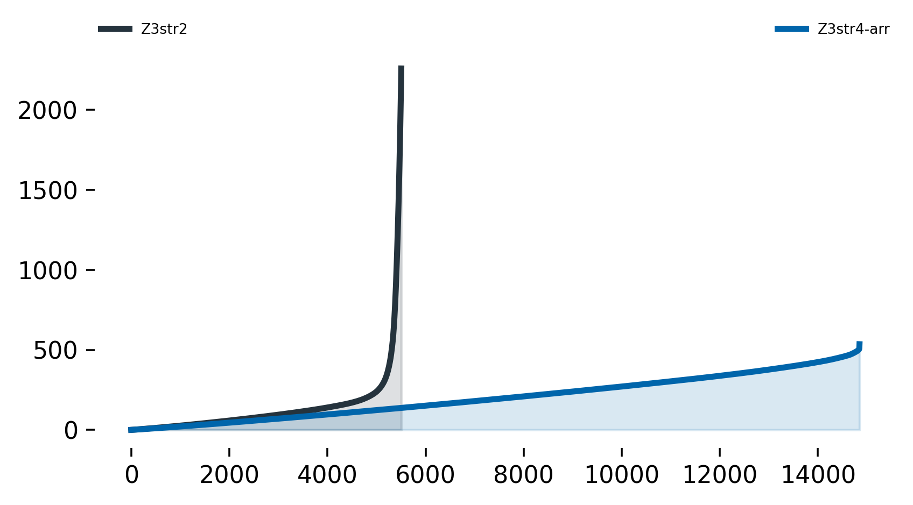

|===
|Solver |Cor. class. (contr.) |SAT |UNSAT |UNKN |ERR |CRA |TO |Par2 |Tot. inst. |Tot. inst. w/o TO | Tot. time |Tot. time w/o TO
|+++<span style="color: #0065AB;font-weight: bold;">Z3str4-arr</span>+++|14848 (6385.12)|1143|13705|240|0|0|10333|425001881|25421|15088|208741881|2081881
|+++<span style="color: #25333D;font-weight: bold;">Z3str2</span>+++|5506 (1025.89)|6381|3812|574|4687|0|14654|1277049099|25421|10767|304829099|11749099
|===

[NOTE]
====
+++<span style="color: #0065AB;font-weight: bold;">Z3str4-arr</span>+++ had the biggest lead with 2.7 and +++<span style="color: #0065AB;font-weight: bold;">Z3str4-arr</span>+++ hat the largest contribution with 6385.12. Other solvers contributed as follows: +++<span style="color: #25333D;font-weight: bold;">Z3str2</span>+++: 1025.89.
====

=== SMTLIB25


[.text-center]
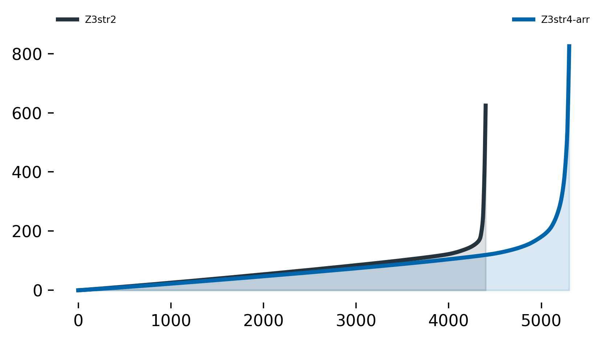

|===
|Solver |Cor. class. (contr.) |SAT |UNSAT |UNKN |ERR |CRA |TO |Par2 |Tot. inst. |Tot. inst. w/o TO | Tot. time |Tot. time w/o TO
|+++<span style="color: #0065AB;font-weight: bold;">Z3str4-arr</span>+++|5302 (140.76)|1800|3502|77|0|0|534|25715170|5913|5379|11955170|1275170
|+++<span style="color: #25333D;font-weight: bold;">Z3str2</span>+++|4401 (68.46)|1793|3455|110|847|0|555|146025612|5913|5358|11945612|845612
|===

[NOTE]
====
+++<span style="color: #0065AB;font-weight: bold;">Z3str4-arr</span>+++ had the biggest lead with 1.2 and +++<span style="color: #0065AB;font-weight: bold;">Z3str4-arr</span>+++ hat the largest contribution with 140.76. Other solvers contributed as follows: +++<span style="color: #25333D;font-weight: bold;">Z3str2</span>+++: 68.46.
====

=== Pisa


[.text-center]
image::img_BV/pisa.png[cactus]

|===
|Solver |Cor. class. (contr.) |SAT |UNSAT |UNKN |ERR |CRA |TO |Par2 |Tot. inst. |Tot. inst. w/o TO | Tot. time |Tot. time w/o TO
|+++<span style="color: #0065AB;font-weight: bold;">Z3str4-arr</span>+++|6 (0.0)|6|0|0|0|0|6|240335|12|6|120335|335
|+++<span style="color: #25333D;font-weight: bold;">Z3str2</span>+++|10 (3.0)|7|4|0|1|0|1|180458|12|11|20458|458
|===

[NOTE]
====
+++<span style="color: #0065AB;font-weight: bold;">Z3str4-arr</span>+++ had the biggest lead with 0.6 and +++<span style="color: #25333D;font-weight: bold;">Z3str2</span>+++ hat the largest contribution with 3.0. Other solvers contributed as follows: +++<span style="color: #0065AB;font-weight: bold;">Z3str4-arr</span>+++: 0.0.
====

=== Norn


[.text-center]
image::img_BV/norn.png[cactus]

|===
|Solver |Cor. class. (contr.) |SAT |UNSAT |UNKN |ERR |CRA |TO |Par2 |Tot. inst. |Tot. inst. w/o TO | Tot. time |Tot. time w/o TO
|+++<span style="color: #0065AB;font-weight: bold;">Z3str4-arr</span>+++|883 (71.85)|693|190|0|0|0|144|5805341|1027|883|2925341|45341
|+++<span style="color: #25333D;font-weight: bold;">Z3str2</span>+++|756 (0.0)|675|85|0|4|0|267|11289739|1027|760|5389739|49739
|===

[NOTE]
====
+++<span style="color: #0065AB;font-weight: bold;">Z3str4-arr</span>+++ had the biggest lead with 1.17 and +++<span style="color: #0065AB;font-weight: bold;">Z3str4-arr</span>+++ hat the largest contribution with 71.85. Other solvers contributed as follows: +++<span style="color: #25333D;font-weight: bold;">Z3str2</span>+++: 0.0.
====

=== Trau Light


[.text-center]
image::img_BV/traulight.png[cactus]

|===
|Solver |Cor. class. (contr.) |SAT |UNSAT |UNKN |ERR |CRA |TO |Par2 |Tot. inst. |Tot. inst. w/o TO | Tot. time |Tot. time w/o TO
|+++<span style="color: #25333D;font-weight: bold;">Z3str2</span>+++|97 (0.0)|4|93|1|0|0|2|123366|100|98|43366|3366
|+++<span style="color: #0065AB;font-weight: bold;">Z3str4-arr</span>+++|97 (0.0)|4|93|1|0|0|2|133050|100|98|53050|13050
|===

[NOTE]
====
+++<span style="color: #25333D;font-weight: bold;">Z3str2</span>+++ had the biggest lead with 1.0 and +++<span style="color: #25333D;font-weight: bold;">Z3str2</span>+++ hat the largest contribution with 0.0. Other solvers contributed as follows: +++<span style="color: #0065AB;font-weight: bold;">Z3str4-arr</span>+++: 0.0.
====

=== Leetcode Strings


[.text-center]
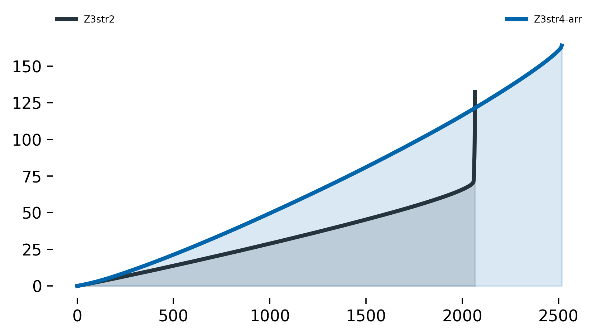

|===
|Solver |Cor. class. (contr.) |SAT |UNSAT |UNKN |ERR |CRA |TO |Par2 |Tot. inst. |Tot. inst. w/o TO | Tot. time |Tot. time w/o TO
|+++<span style="color: #0065AB;font-weight: bold;">Z3str4-arr</span>+++|2517 (87.22)|706|1811|14|0|0|130|5962291|2661|2531|2802291|202291
|+++<span style="color: #25333D;font-weight: bold;">Z3str2</span>+++|2067 (16.84)|620|1785|131|338|0|125|57730966|2661|2536|2670966|170966
|===

[NOTE]
====
+++<span style="color: #0065AB;font-weight: bold;">Z3str4-arr</span>+++ had the biggest lead with 1.22 and +++<span style="color: #0065AB;font-weight: bold;">Z3str4-arr</span>+++ hat the largest contribution with 87.22. Other solvers contributed as follows: +++<span style="color: #25333D;font-weight: bold;">Z3str2</span>+++: 16.84.
====

=== IBM Appscan


[.text-center]
image::img_BV/ibmappscan.png[cactus]

|===
|Solver |Cor. class. (contr.) |SAT |UNSAT |UNKN |ERR |CRA |TO |Par2 |Tot. inst. |Tot. inst. w/o TO | Tot. time |Tot. time w/o TO
|+++<span style="color: #0065AB;font-weight: bold;">Z3str4-arr</span>+++|5 (1.33)|5|0|0|0|0|3|120506|8|5|60506|506
|+++<span style="color: #25333D;font-weight: bold;">Z3str2</span>+++|2 (0.0)|4|0|0|2|0|4|440193|8|4|80193|193
|===

[NOTE]
====
+++<span style="color: #0065AB;font-weight: bold;">Z3str4-arr</span>+++ had the biggest lead with 2.5 and +++<span style="color: #0065AB;font-weight: bold;">Z3str4-arr</span>+++ hat the largest contribution with 1.33. Other solvers contributed as follows: +++<span style="color: #25333D;font-weight: bold;">Z3str2</span>+++: 0.0.
====

=== Sloth


[.text-center]
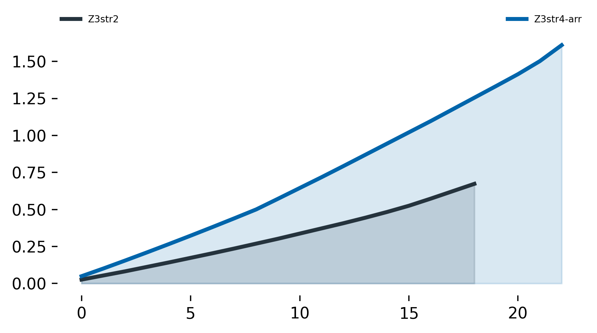

|===
|Solver |Cor. class. (contr.) |SAT |UNSAT |UNKN |ERR |CRA |TO |Par2 |Tot. inst. |Tot. inst. w/o TO | Tot. time |Tot. time w/o TO
|+++<span style="color: #0065AB;font-weight: bold;">Z3str4-arr</span>+++|23 (2.09)|10|13|0|0|0|1|41610|24|23|21610|1610
|+++<span style="color: #25333D;font-weight: bold;">Z3str2</span>+++|19 (0.0)|9|10|0|0|0|5|200673|24|19|100673|673
|===

[NOTE]
====
+++<span style="color: #0065AB;font-weight: bold;">Z3str4-arr</span>+++ had the biggest lead with 1.21 and +++<span style="color: #0065AB;font-weight: bold;">Z3str4-arr</span>+++ hat the largest contribution with 2.09. Other solvers contributed as follows: +++<span style="color: #25333D;font-weight: bold;">Z3str2</span>+++: 0.0.
====

=== Woorpje Word Equations


[.text-center]
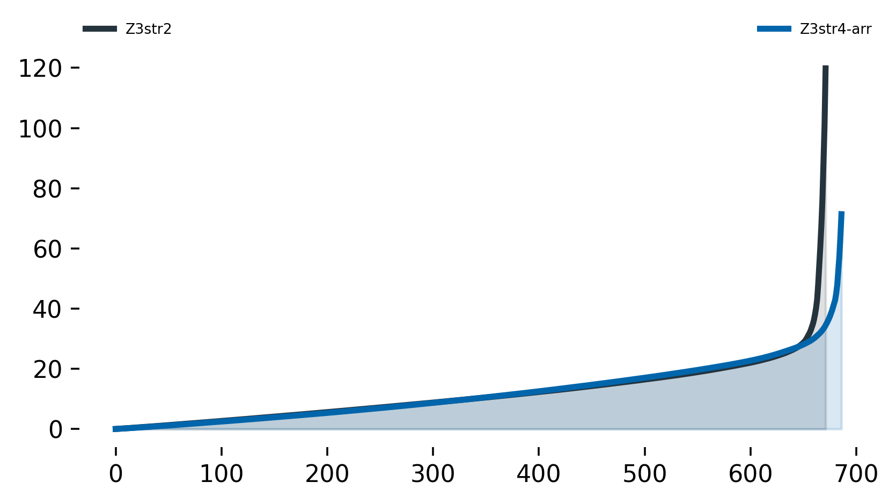

|===
|Solver |Cor. class. (contr.) |SAT |UNSAT |UNKN |ERR |CRA |TO |Par2 |Tot. inst. |Tot. inst. w/o TO | Tot. time |Tot. time w/o TO
|+++<span style="color: #0065AB;font-weight: bold;">Z3str4-arr</span>+++|687 (9.41)|523|172|11|8|0|103|5819968|809|706|2199968|139968
|+++<span style="color: #25333D;font-weight: bold;">Z3str2</span>+++|672 (7.64)|521|171|14|20|0|103|7625988|809|706|2205988|145988
|===

[NOTE]
====
+++<span style="color: #0065AB;font-weight: bold;">Z3str4-arr</span>+++ had the biggest lead with 1.02 and +++<span style="color: #0065AB;font-weight: bold;">Z3str4-arr</span>+++ hat the largest contribution with 9.41. Other solvers contributed as follows: +++<span style="color: #25333D;font-weight: bold;">Z3str2</span>+++: 7.64.
====

=== Kaluza


[.text-center]
image::img_BV/kaluza.png[cactus]

|===
|Solver |Cor. class. (contr.) |SAT |UNSAT |UNKN |ERR |CRA |TO |Par2 |Tot. inst. |Tot. inst. w/o TO | Tot. time |Tot. time w/o TO
|+++<span style="color: #0065AB;font-weight: bold;">Z3str4-arr</span>+++|46526 (110.46)|34539|11987|99|0|0|659|34304368|47284|46625|17164368|3984368
|+++<span style="color: #25333D;font-weight: bold;">Z3str2</span>+++|41753 (8.45)|34406|11975|39|4628|0|864|687633462|47284|46420|20873462|3593462
|===

[NOTE]
====
+++<span style="color: #0065AB;font-weight: bold;">Z3str4-arr</span>+++ had the biggest lead with 1.11 and +++<span style="color: #0065AB;font-weight: bold;">Z3str4-arr</span>+++ hat the largest contribution with 110.46. Other solvers contributed as follows: +++<span style="color: #25333D;font-weight: bold;">Z3str2</span>+++: 8.45.
====

=== StringFuzz


[.text-center]
image::img_BV/stringfuzz.png[cactus]

|===
|Solver |Cor. class. (contr.) |SAT |UNSAT |UNKN |ERR |CRA |TO |Par2 |Tot. inst. |Tot. inst. w/o TO | Tot. time |Tot. time w/o TO
|+++<span style="color: #0065AB;font-weight: bold;">Z3str4-arr</span>+++|890 (68.81)|662|228|0|0|0|175|7388595|1065|890|3888595|388595
|+++<span style="color: #25333D;font-weight: bold;">Z3str2</span>+++|775 (0.0)|592|183|5|0|0|285|11865466|1065|780|5965466|265466
|===

[NOTE]
====
+++<span style="color: #0065AB;font-weight: bold;">Z3str4-arr</span>+++ had the biggest lead with 1.15 and +++<span style="color: #0065AB;font-weight: bold;">Z3str4-arr</span>+++ hat the largest contribution with 68.81. Other solvers contributed as follows: +++<span style="color: #25333D;font-weight: bold;">Z3str2</span>+++: 0.0.
====

=== z3Str3 Regression


[.text-center]
image::img_BV/z3str3regression.png[cactus]

|===
|Solver |Cor. class. (contr.) |SAT |UNSAT |UNKN |ERR |CRA |TO |Par2 |Tot. inst. |Tot. inst. w/o TO | Tot. time |Tot. time w/o TO
|+++<span style="color: #0065AB;font-weight: bold;">Z3str4-arr</span>+++|238 (2.28)|192|46|0|0|0|4|170959|242|238|90959|10959
|+++<span style="color: #25333D;font-weight: bold;">Z3str2</span>+++|208 (1.14)|195|43|1|30|0|3|4368177|242|239|68177|8177
|===

[NOTE]
====
+++<span style="color: #0065AB;font-weight: bold;">Z3str4-arr</span>+++ had the biggest lead with 1.14 and +++<span style="color: #0065AB;font-weight: bold;">Z3str4-arr</span>+++ hat the largest contribution with 2.28. Other solvers contributed as follows: +++<span style="color: #25333D;font-weight: bold;">Z3str2</span>+++: 1.14.
====

=== Cashew


[.text-center]
image::img_BV/cashew.png[cactus]

|===
|Solver |Cor. class. (contr.) |SAT |UNSAT |UNKN |ERR |CRA |TO |Par2 |Tot. inst. |Tot. inst. w/o TO | Tot. time |Tot. time w/o TO
|+++<span style="color: #0065AB;font-weight: bold;">Z3str4-arr</span>+++|394 (0.0)|382|12|0|0|0|0|17067|394|394|17067|17067
|+++<span style="color: #25333D;font-weight: bold;">Z3str2</span>+++|392 (0.0)|382|12|0|2|0|0|302628|394|394|22628|22628
|===

[NOTE]
====
+++<span style="color: #0065AB;font-weight: bold;">Z3str4-arr</span>+++ had the biggest lead with 1.01 and +++<span style="color: #25333D;font-weight: bold;">Z3str2</span>+++ hat the largest contribution with 0.0. Other solvers contributed as follows: +++<span style="color: #0065AB;font-weight: bold;">Z3str4-arr</span>+++: 0.0.
====

=== JOACO


[.text-center]
image::img_BV/joaco.png[cactus]

|===
|Solver |Cor. class. (contr.) |SAT |UNSAT |UNKN |ERR |CRA |TO |Par2 |Tot. inst. |Tot. inst. w/o TO | Tot. time |Tot. time w/o TO
|+++<span style="color: #0065AB;font-weight: bold;">Z3str4-arr</span>+++|37 (15.67)|17|20|57|0|0|0|2284465|94|94|4465|4465
|+++<span style="color: #25333D;font-weight: bold;">Z3str2</span>+++|20 (0.0)|7|20|67|7|0|0|3665957|94|94|5957|5957
|===

[NOTE]
====
+++<span style="color: #0065AB;font-weight: bold;">Z3str4-arr</span>+++ had the biggest lead with 1.85 and +++<span style="color: #0065AB;font-weight: bold;">Z3str4-arr</span>+++ hat the largest contribution with 15.67. Other solvers contributed as follows: +++<span style="color: #25333D;font-weight: bold;">Z3str2</span>+++: 0.0.
====

=== Stranger


[.text-center]
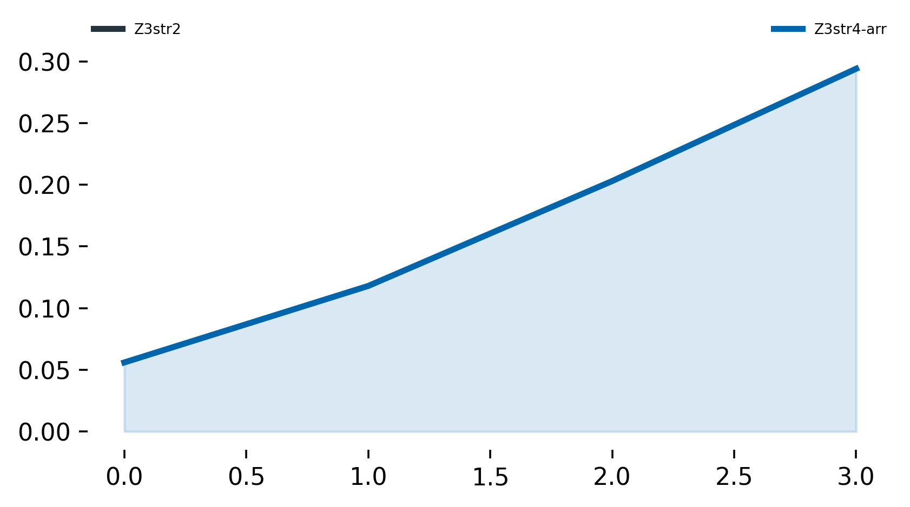

|===
|Solver |Cor. class. (contr.) |SAT |UNSAT |UNKN |ERR |CRA |TO |Par2 |Tot. inst. |Tot. inst. w/o TO | Tot. time |Tot. time w/o TO
|+++<span style="color: #0065AB;font-weight: bold;">Z3str4-arr</span>+++|4 (2.0)|4|0|0|0|0|0|294|4|4|294|294
|+++<span style="color: #25333D;font-weight: bold;">Z3str2</span>+++|0 (0.0)|0|0|4|0|0|0|160611|4|4|611|611
|===

[NOTE]
====
+++<span style="color: #0065AB;font-weight: bold;">Z3str4-arr</span>+++ had the biggest lead with 0 and +++<span style="color: #0065AB;font-weight: bold;">Z3str4-arr</span>+++ hat the largest contribution with 2.0. Other solvers contributed as follows: +++<span style="color: #25333D;font-weight: bold;">Z3str2</span>+++: 0.0.
====

=== Kausler


[.text-center]
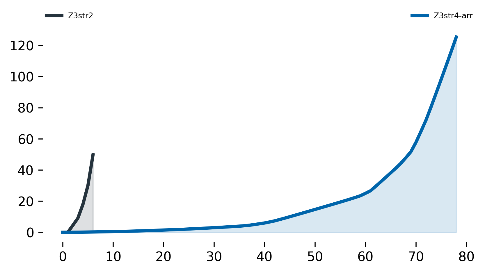

|===
|Solver |Cor. class. (contr.) |SAT |UNSAT |UNKN |ERR |CRA |TO |Par2 |Tot. inst. |Tot. inst. w/o TO | Tot. time |Tot. time w/o TO
|+++<span style="color: #0065AB;font-weight: bold;">Z3str4-arr</span>+++|79 (0.0)|79|0|5|0|0|36|1772295|120|84|852295|132295
|+++<span style="color: #25333D;font-weight: bold;">Z3str2</span>+++|7 (42.86)|119|0|0|112|0|1|15807510|120|119|107510|87510
|===

[NOTE]
====
+++<span style="color: #0065AB;font-weight: bold;">Z3str4-arr</span>+++ had the biggest lead with 11.29 and +++<span style="color: #25333D;font-weight: bold;">Z3str2</span>+++ hat the largest contribution with 42.86. Other solvers contributed as follows: +++<span style="color: #0065AB;font-weight: bold;">Z3str4-arr</span>+++: 0.0.
====

=== BanditFuzz


[.text-center]
image::img_BV/banditfuzz.png[cactus]

|===
|Solver |Cor. class. (contr.) |SAT |UNSAT |UNKN |ERR |CRA |TO |Par2 |Tot. inst. |Tot. inst. w/o TO | Tot. time |Tot. time w/o TO
|+++<span style="color: #0065AB;font-weight: bold;">Z3str4-arr</span>+++|299 (3.53)|14|285|5|0|0|53|2371549|357|304|1111549|51549
|+++<span style="color: #25333D;font-weight: bold;">Z3str2</span>+++|297 (4.12)|24|286|2|13|0|45|3782843|357|312|982843|82843
|===

[NOTE]
====
+++<span style="color: #0065AB;font-weight: bold;">Z3str4-arr</span>+++ had the biggest lead with 1.01 and +++<span style="color: #25333D;font-weight: bold;">Z3str2</span>+++ hat the largest contribution with 4.12. Other solvers contributed as follows: +++<span style="color: #0065AB;font-weight: bold;">Z3str4-arr</span>+++: 3.53.
====

=== automatark25


[.text-center]
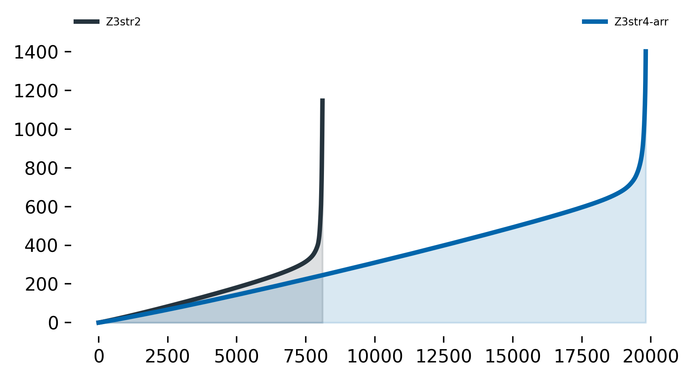

|===
|Solver |Cor. class. (contr.) |SAT |UNSAT |UNKN |ERR |CRA |TO |Par2 |Tot. inst. |Tot. inst. w/o TO | Tot. time |Tot. time w/o TO
|+++<span style="color: #0065AB;font-weight: bold;">Z3str4-arr</span>+++|19816 (4026.98)|14437|5379|0|0|0|163|7921911|19979|19816|4661911|1401911
|+++<span style="color: #25333D;font-weight: bold;">Z3str2</span>+++|8108 (6.62)|11643|2708|4759|6243|3|869|1101582230|19979|19110|19822230|2442230
|===

[NOTE]
====
+++<span style="color: #0065AB;font-weight: bold;">Z3str4-arr</span>+++ had the biggest lead with 2.44 and +++<span style="color: #0065AB;font-weight: bold;">Z3str4-arr</span>+++ hat the largest contribution with 4026.98. Other solvers contributed as follows: +++<span style="color: #25333D;font-weight: bold;">Z3str2</span>+++: 6.62.
====

=== stringfuzzregexgenerated


[.text-center]
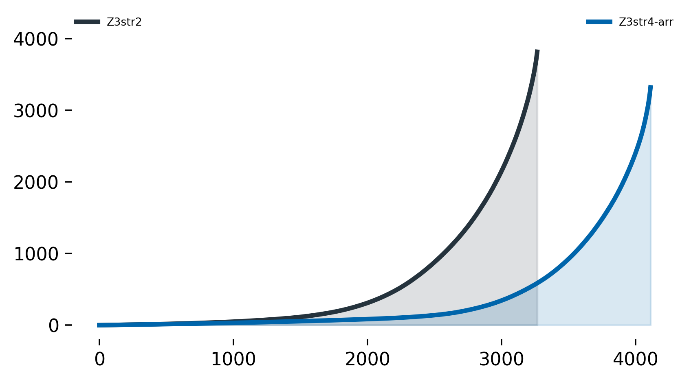

|===
|Solver |Cor. class. (contr.) |SAT |UNSAT |UNKN |ERR |CRA |TO |Par2 |Tot. inst. |Tot. inst. w/o TO | Tot. time |Tot. time w/o TO
|+++<span style="color: #0065AB;font-weight: bold;">Z3str4-arr</span>+++|4111 (432.18)|3281|830|10|0|0|49|5705209|4170|4121|4325209|3345209
|+++<span style="color: #25333D;font-weight: bold;">Z3str2</span>+++|3266 (5.06)|3232|35|0|1|0|903|40084881|4170|3267|21884881|3824881
|===

[NOTE]
====
+++<span style="color: #0065AB;font-weight: bold;">Z3str4-arr</span>+++ had the biggest lead with 1.26 and +++<span style="color: #0065AB;font-weight: bold;">Z3str4-arr</span>+++ hat the largest contribution with 432.18. Other solvers contributed as follows: +++<span style="color: #25333D;font-weight: bold;">Z3str2</span>+++: 5.06.
====

=== stringfuzzregextransformed


[.text-center]
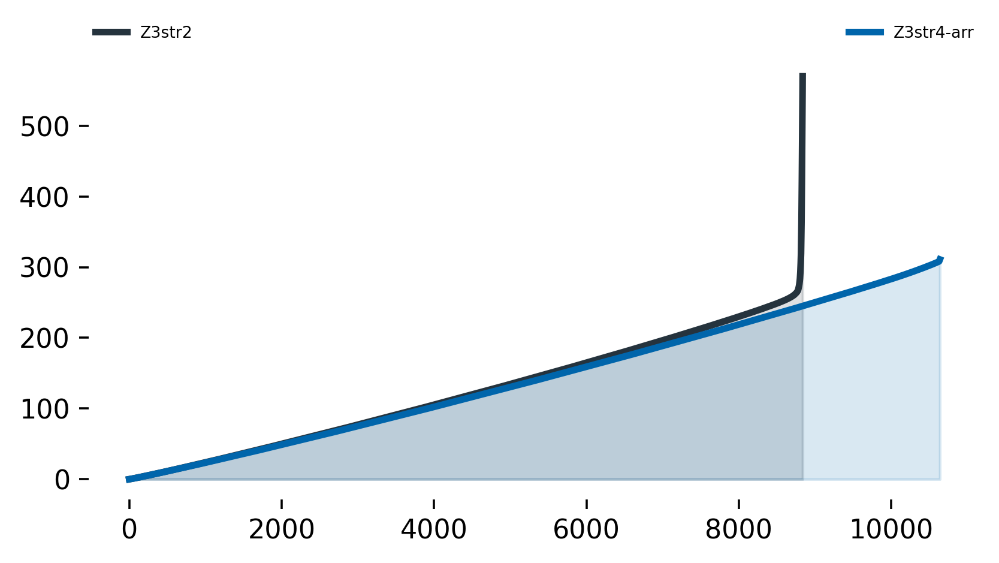

|===
|Solver |Cor. class. (contr.) |SAT |UNSAT |UNKN |ERR |CRA |TO |Par2 |Tot. inst. |Tot. inst. w/o TO | Tot. time |Tot. time w/o TO
|+++<span style="color: #0065AB;font-weight: bold;">Z3str4-arr</span>+++|10639 (680.74)|4598|6041|6|0|0|37|2031029|10682|10645|1051029|311029
|+++<span style="color: #25333D;font-weight: bold;">Z3str2</span>+++|8838 (7.91)|4459|4906|0|527|0|1317|127049304|10682|9365|26929304|589304
|===

[NOTE]
====
+++<span style="color: #0065AB;font-weight: bold;">Z3str4-arr</span>+++ had the biggest lead with 1.2 and +++<span style="color: #0065AB;font-weight: bold;">Z3str4-arr</span>+++ hat the largest contribution with 680.74. Other solvers contributed as follows: +++<span style="color: #25333D;font-weight: bold;">Z3str2</span>+++: 7.91.
====

=== Total


[.text-center]
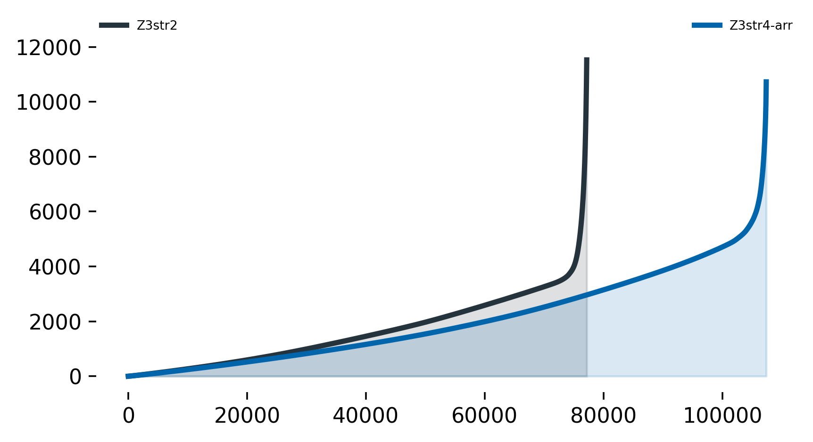

|===
|Solver |Cor. class. (contr.) |SAT |UNSAT |UNKN |ERR |CRA |TO |Par2 |Tot. inst. |Tot. inst. w/o TO | Tot. time |Tot. time w/o TO
|+++<span style="color: #0065AB;font-weight: bold;">Z3str4-arr</span>+++|107401 (9252.07)|63095|44314|525|8|0|12432|532807893|120366|107934|262047893|13407893
|+++<span style="color: #25333D;font-weight: bold;">Z3str2</span>+++|77194 (731.69)|65073|29583|5707|17462|3|20003|3496969163|120366|100363|423949163|23889163
|===

[NOTE]
====
+++<span style="color: #0065AB;font-weight: bold;">Z3str4-arr</span>+++ had the biggest lead with 1.39 and +++<span style="color: #0065AB;font-weight: bold;">Z3str4-arr</span>+++ hat the largest contribution with 9252.07. Other solvers contributed as follows: +++<span style="color: #25333D;font-weight: bold;">Z3str2</span>+++: 731.69.
====


== Clause-sharing Experiment

=== PyEx


[.text-center]
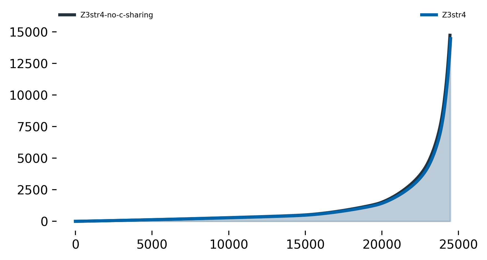

|===
|Solver |Cor. class. (contr.) |SAT |UNSAT |UNKN |ERR |CRA |TO |Par2 |Tot. inst. |Tot. inst. w/o TO | Tot. time |Tot. time w/o TO
|+++<span style="color: #0065AB;font-weight: bold;">Z3str4</span>+++|24483 (28.54)|10789|13694|37|0|0|901|52372918|25421|24520|32872918|14852918
|+++<span style="color: #25333D;font-weight: bold;">Z3str4-no-c-sharing</span>+++|24439 (5.71)|10747|13692|35|0|0|947|54429828|25421|24474|34089828|15149828
|===

[NOTE]
====
+++<span style="color: #0065AB;font-weight: bold;">Z3str4</span>+++ had the biggest lead with 1.0 and +++<span style="color: #0065AB;font-weight: bold;">Z3str4</span>+++ hat the largest contribution with 28.54. Other solvers contributed as follows: +++<span style="color: #25333D;font-weight: bold;">Z3str4-no-c-sharing</span>+++: 5.71.
====

=== SMTLIB25


[.text-center]
image::img_CLAUSE/smtlib25.png[cactus]

|===
|Solver |Cor. class. (contr.) |SAT |UNSAT |UNKN |ERR |CRA |TO |Par2 |Tot. inst. |Tot. inst. w/o TO | Tot. time |Tot. time w/o TO
|+++<span style="color: #25333D;font-weight: bold;">Z3str4-no-c-sharing</span>+++|5464 (19.89)|1871|3593|4|0|1|445|19435405|5913|5468|10375405|1475405
|+++<span style="color: #0065AB;font-weight: bold;">Z3str4</span>+++|5463 (19.35)|1869|3594|6|0|0|444|19503735|5913|5469|10383735|1503735
|===

[NOTE]
====
+++<span style="color: #25333D;font-weight: bold;">Z3str4-no-c-sharing</span>+++ had the biggest lead with 1.0 and +++<span style="color: #25333D;font-weight: bold;">Z3str4-no-c-sharing</span>+++ hat the largest contribution with 19.89. Other solvers contributed as follows: +++<span style="color: #0065AB;font-weight: bold;">Z3str4</span>+++: 19.35.
====

=== Pisa


[.text-center]
image::img_CLAUSE/pisa.png[cactus]

|===
|Solver |Cor. class. (contr.) |SAT |UNSAT |UNKN |ERR |CRA |TO |Par2 |Tot. inst. |Tot. inst. w/o TO | Tot. time |Tot. time w/o TO
|+++<span style="color: #0065AB;font-weight: bold;">Z3str4</span>+++|8 (0.0)|8|0|0|0|0|4|160583|12|8|80583|583
|+++<span style="color: #25333D;font-weight: bold;">Z3str4-no-c-sharing</span>+++|8 (0.0)|8|0|0|0|0|4|160703|12|8|80703|703
|===

[NOTE]
====
+++<span style="color: #0065AB;font-weight: bold;">Z3str4</span>+++ had the biggest lead with 1.0 and +++<span style="color: #25333D;font-weight: bold;">Z3str4-no-c-sharing</span>+++ hat the largest contribution with 0.0. Other solvers contributed as follows: +++<span style="color: #0065AB;font-weight: bold;">Z3str4</span>+++: 0.0.
====

=== Norn


[.text-center]
image::img_CLAUSE/norn.png[cactus]

|===
|Solver |Cor. class. (contr.) |SAT |UNSAT |UNKN |ERR |CRA |TO |Par2 |Tot. inst. |Tot. inst. w/o TO | Tot. time |Tot. time w/o TO
|+++<span style="color: #0065AB;font-weight: bold;">Z3str4</span>+++|954 (0.0)|712|242|0|0|0|73|3027248|1027|954|1567248|107248
|+++<span style="color: #25333D;font-weight: bold;">Z3str4-no-c-sharing</span>+++|954 (0.0)|712|242|0|0|0|73|3031093|1027|954|1571093|111093
|===

[NOTE]
====
+++<span style="color: #0065AB;font-weight: bold;">Z3str4</span>+++ had the biggest lead with 1.0 and +++<span style="color: #25333D;font-weight: bold;">Z3str4-no-c-sharing</span>+++ hat the largest contribution with 0.0. Other solvers contributed as follows: +++<span style="color: #0065AB;font-weight: bold;">Z3str4</span>+++: 0.0.
====

=== Trau Light


[.text-center]
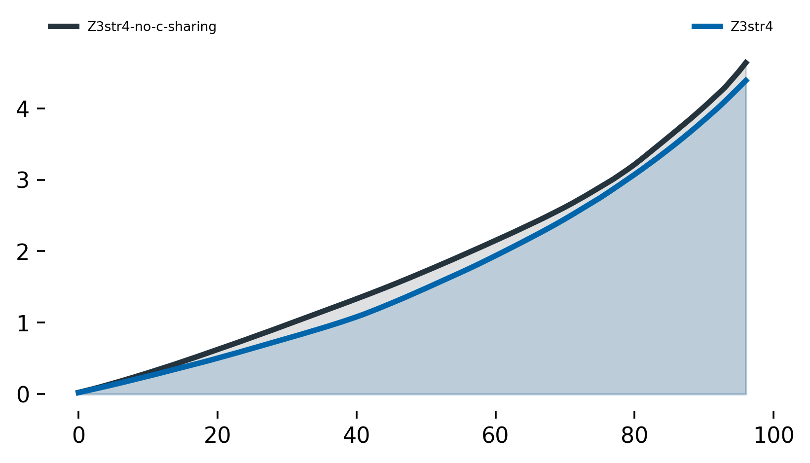

|===
|Solver |Cor. class. (contr.) |SAT |UNSAT |UNKN |ERR |CRA |TO |Par2 |Tot. inst. |Tot. inst. w/o TO | Tot. time |Tot. time w/o TO
|+++<span style="color: #0065AB;font-weight: bold;">Z3str4</span>+++|97 (0.0)|4|93|0|0|0|3|124388|100|97|64388|4388
|+++<span style="color: #25333D;font-weight: bold;">Z3str4-no-c-sharing</span>+++|97 (0.0)|4|93|0|0|0|3|124637|100|97|64637|4637
|===

[NOTE]
====
+++<span style="color: #0065AB;font-weight: bold;">Z3str4</span>+++ had the biggest lead with 1.0 and +++<span style="color: #25333D;font-weight: bold;">Z3str4-no-c-sharing</span>+++ hat the largest contribution with 0.0. Other solvers contributed as follows: +++<span style="color: #0065AB;font-weight: bold;">Z3str4</span>+++: 0.0.
====

=== Leetcode Strings


[.text-center]
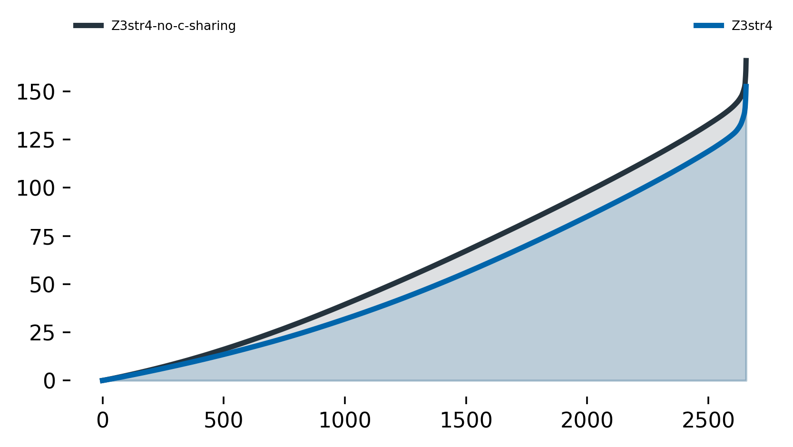

|===
|Solver |Cor. class. (contr.) |SAT |UNSAT |UNKN |ERR |CRA |TO |Par2 |Tot. inst. |Tot. inst. w/o TO | Tot. time |Tot. time w/o TO
|+++<span style="color: #0065AB;font-weight: bold;">Z3str4</span>+++|2657 (0.0)|846|1811|1|0|0|3|312633|2661|2658|212633|152633
|+++<span style="color: #25333D;font-weight: bold;">Z3str4-no-c-sharing</span>+++|2657 (0.0)|846|1811|1|0|0|3|326138|2661|2658|226138|166138
|===

[NOTE]
====
+++<span style="color: #0065AB;font-weight: bold;">Z3str4</span>+++ had the biggest lead with 1.0 and +++<span style="color: #25333D;font-weight: bold;">Z3str4-no-c-sharing</span>+++ hat the largest contribution with 0.0. Other solvers contributed as follows: +++<span style="color: #0065AB;font-weight: bold;">Z3str4</span>+++: 0.0.
====

=== IBM Appscan


[.text-center]
image::img_CLAUSE/ibmappscan.png[cactus]

|===
|Solver |Cor. class. (contr.) |SAT |UNSAT |UNKN |ERR |CRA |TO |Par2 |Tot. inst. |Tot. inst. w/o TO | Tot. time |Tot. time w/o TO
|+++<span style="color: #25333D;font-weight: bold;">Z3str4-no-c-sharing</span>+++|6 (0.67)|6|0|0|0|0|2|82609|8|6|42609|2609
|+++<span style="color: #0065AB;font-weight: bold;">Z3str4</span>+++|5 (0.0)|5|0|0|0|0|3|121421|8|5|61421|1421
|===

[NOTE]
====
+++<span style="color: #25333D;font-weight: bold;">Z3str4-no-c-sharing</span>+++ had the biggest lead with 1.2 and +++<span style="color: #25333D;font-weight: bold;">Z3str4-no-c-sharing</span>+++ hat the largest contribution with 0.67. Other solvers contributed as follows: +++<span style="color: #0065AB;font-weight: bold;">Z3str4</span>+++: 0.0.
====

=== Sloth


[.text-center]
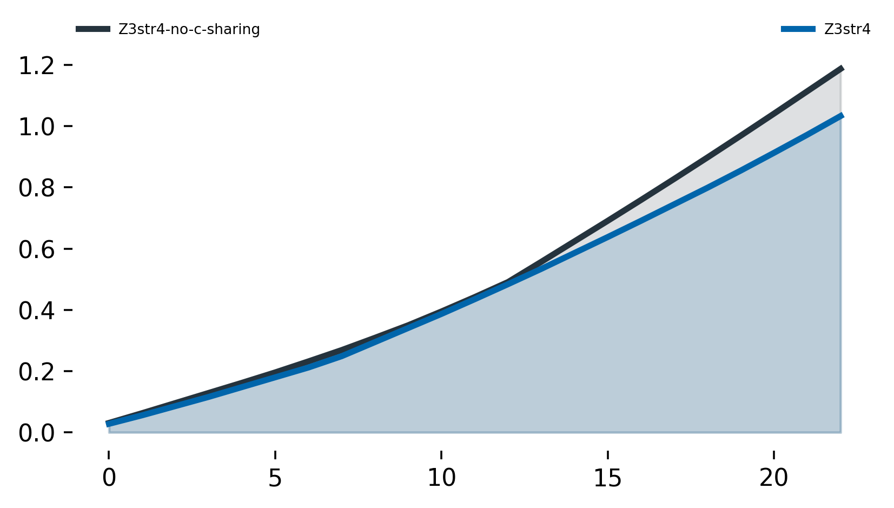

|===
|Solver |Cor. class. (contr.) |SAT |UNSAT |UNKN |ERR |CRA |TO |Par2 |Tot. inst. |Tot. inst. w/o TO | Tot. time |Tot. time w/o TO
|+++<span style="color: #0065AB;font-weight: bold;">Z3str4</span>+++|23 (0.0)|10|13|0|0|0|1|41033|24|23|21033|1033
|+++<span style="color: #25333D;font-weight: bold;">Z3str4-no-c-sharing</span>+++|23 (0.0)|10|13|0|0|0|1|41187|24|23|21187|1187
|===

[NOTE]
====
+++<span style="color: #0065AB;font-weight: bold;">Z3str4</span>+++ had the biggest lead with 1.0 and +++<span style="color: #25333D;font-weight: bold;">Z3str4-no-c-sharing</span>+++ hat the largest contribution with 0.0. Other solvers contributed as follows: +++<span style="color: #0065AB;font-weight: bold;">Z3str4</span>+++: 0.0.
====

=== Woorpje Word Equations


[.text-center]
image::img_CLAUSE/woorpjewordequations.png[cactus]

|===
|Solver |Cor. class. (contr.) |SAT |UNSAT |UNKN |ERR |CRA |TO |Par2 |Tot. inst. |Tot. inst. w/o TO | Tot. time |Tot. time w/o TO
|+++<span style="color: #0065AB;font-weight: bold;">Z3str4</span>+++|727 (6.05)|563|164|0|0|0|82|3354318|809|727|1714318|74318
|+++<span style="color: #25333D;font-weight: bold;">Z3str4-no-c-sharing</span>+++|725 (4.95)|561|164|0|0|0|84|3435015|809|725|1755015|75015
|===

[NOTE]
====
+++<span style="color: #0065AB;font-weight: bold;">Z3str4</span>+++ had the biggest lead with 1.0 and +++<span style="color: #0065AB;font-weight: bold;">Z3str4</span>+++ hat the largest contribution with 6.05. Other solvers contributed as follows: +++<span style="color: #25333D;font-weight: bold;">Z3str4-no-c-sharing</span>+++: 4.95.
====

=== Kaluza


[.text-center]
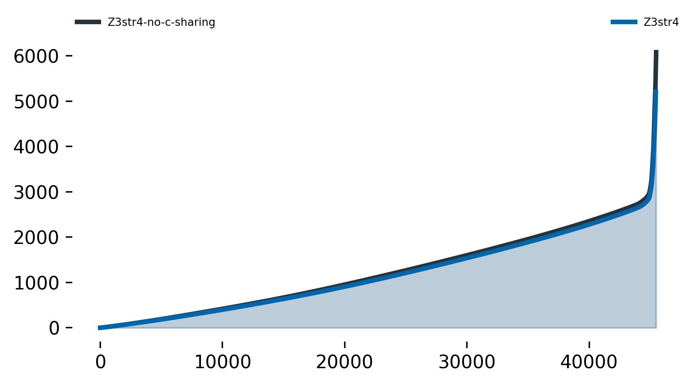

|===
|Solver |Cor. class. (contr.) |SAT |UNSAT |UNKN |ERR |CRA |TO |Par2 |Tot. inst. |Tot. inst. w/o TO | Tot. time |Tot. time w/o TO
|+++<span style="color: #25333D;font-weight: bold;">Z3str4-no-c-sharing</span>+++|45471 (16.64)|33484|11987|60|0|0|1753|79203808|47284|45531|41743808|6683808
|+++<span style="color: #0065AB;font-weight: bold;">Z3str4</span>+++|45444 (2.6)|33458|11986|64|0|0|1776|79420496|47284|45508|41340496|5820496
|===

[NOTE]
====
+++<span style="color: #25333D;font-weight: bold;">Z3str4-no-c-sharing</span>+++ had the biggest lead with 1.0 and +++<span style="color: #25333D;font-weight: bold;">Z3str4-no-c-sharing</span>+++ hat the largest contribution with 16.64. Other solvers contributed as follows: +++<span style="color: #0065AB;font-weight: bold;">Z3str4</span>+++: 2.6.
====

=== StringFuzz


[.text-center]
image::img_CLAUSE/stringfuzz.png[cactus]

|===
|Solver |Cor. class. (contr.) |SAT |UNSAT |UNKN |ERR |CRA |TO |Par2 |Tot. inst. |Tot. inst. w/o TO | Tot. time |Tot. time w/o TO
|+++<span style="color: #0065AB;font-weight: bold;">Z3str4</span>+++|714 (0.75)|412|302|45|0|0|306|14595111|1065|759|6675111|555111
|+++<span style="color: #25333D;font-weight: bold;">Z3str4-no-c-sharing</span>+++|713 (0.0)|411|302|46|0|0|306|14683708|1065|759|6723708|603708
|===

[NOTE]
====
+++<span style="color: #0065AB;font-weight: bold;">Z3str4</span>+++ had the biggest lead with 1.0 and +++<span style="color: #0065AB;font-weight: bold;">Z3str4</span>+++ hat the largest contribution with 0.75. Other solvers contributed as follows: +++<span style="color: #25333D;font-weight: bold;">Z3str4-no-c-sharing</span>+++: 0.0.
====

=== z3Str3 Regression


[.text-center]
image::img_CLAUSE/z3str3regression.png[cactus]

|===
|Solver |Cor. class. (contr.) |SAT |UNSAT |UNKN |ERR |CRA |TO |Par2 |Tot. inst. |Tot. inst. w/o TO | Tot. time |Tot. time w/o TO
|+++<span style="color: #0065AB;font-weight: bold;">Z3str4</span>+++|233 (0.0)|196|37|0|0|0|9|367287|242|233|187287|7287
|+++<span style="color: #25333D;font-weight: bold;">Z3str4-no-c-sharing</span>+++|233 (0.0)|196|37|0|0|0|9|368294|242|233|188294|8294
|===

[NOTE]
====
+++<span style="color: #0065AB;font-weight: bold;">Z3str4</span>+++ had the biggest lead with 1.0 and +++<span style="color: #25333D;font-weight: bold;">Z3str4-no-c-sharing</span>+++ hat the largest contribution with 0.0. Other solvers contributed as follows: +++<span style="color: #0065AB;font-weight: bold;">Z3str4</span>+++: 0.0.
====

=== Cashew


[.text-center]
image::img_CLAUSE/cashew.png[cactus]

|===
|Solver |Cor. class. (contr.) |SAT |UNSAT |UNKN |ERR |CRA |TO |Par2 |Tot. inst. |Tot. inst. w/o TO | Tot. time |Tot. time w/o TO
|+++<span style="color: #0065AB;font-weight: bold;">Z3str4</span>+++|394 (0.0)|382|12|0|0|0|0|22184|394|394|22184|22184
|+++<span style="color: #25333D;font-weight: bold;">Z3str4-no-c-sharing</span>+++|394 (0.0)|382|12|0|0|0|0|23527|394|394|23527|23527
|===

[NOTE]
====
+++<span style="color: #0065AB;font-weight: bold;">Z3str4</span>+++ had the biggest lead with 1.0 and +++<span style="color: #25333D;font-weight: bold;">Z3str4-no-c-sharing</span>+++ hat the largest contribution with 0.0. Other solvers contributed as follows: +++<span style="color: #0065AB;font-weight: bold;">Z3str4</span>+++: 0.0.
====

=== JOACO


[.text-center]
image::img_CLAUSE/joaco.png[cactus]

|===
|Solver |Cor. class. (contr.) |SAT |UNSAT |UNKN |ERR |CRA |TO |Par2 |Tot. inst. |Tot. inst. w/o TO | Tot. time |Tot. time w/o TO
|+++<span style="color: #0065AB;font-weight: bold;">Z3str4</span>+++|94 (0.0)|73|21|0|0|0|0|31331|94|94|31331|31331
|+++<span style="color: #25333D;font-weight: bold;">Z3str4-no-c-sharing</span>+++|94 (0.0)|73|21|0|0|0|0|32194|94|94|32194|32194
|===

[NOTE]
====
+++<span style="color: #0065AB;font-weight: bold;">Z3str4</span>+++ had the biggest lead with 1.0 and +++<span style="color: #25333D;font-weight: bold;">Z3str4-no-c-sharing</span>+++ hat the largest contribution with 0.0. Other solvers contributed as follows: +++<span style="color: #0065AB;font-weight: bold;">Z3str4</span>+++: 0.0.
====

=== Stranger


[.text-center]
image::img_CLAUSE/stranger.png[cactus]

|===
|Solver |Cor. class. (contr.) |SAT |UNSAT |UNKN |ERR |CRA |TO |Par2 |Tot. inst. |Tot. inst. w/o TO | Tot. time |Tot. time w/o TO
|+++<span style="color: #0065AB;font-weight: bold;">Z3str4</span>+++|4 (0.0)|4|0|0|0|0|0|4317|4|4|4317|4317
|+++<span style="color: #25333D;font-weight: bold;">Z3str4-no-c-sharing</span>+++|4 (0.0)|4|0|0|0|0|0|4321|4|4|4321|4321
|===

[NOTE]
====
+++<span style="color: #0065AB;font-weight: bold;">Z3str4</span>+++ had the biggest lead with 1.0 and +++<span style="color: #25333D;font-weight: bold;">Z3str4-no-c-sharing</span>+++ hat the largest contribution with 0.0. Other solvers contributed as follows: +++<span style="color: #0065AB;font-weight: bold;">Z3str4</span>+++: 0.0.
====

=== Kausler


[.text-center]
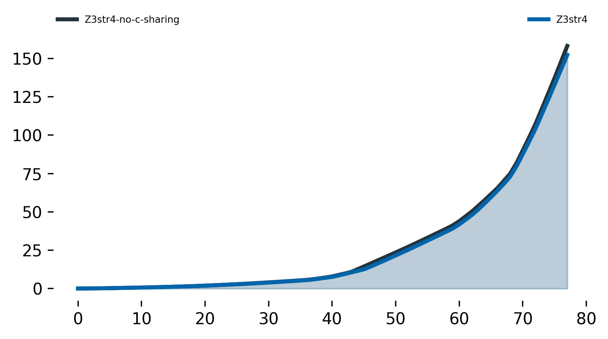

|===
|Solver |Cor. class. (contr.) |SAT |UNSAT |UNKN |ERR |CRA |TO |Par2 |Tot. inst. |Tot. inst. w/o TO | Tot. time |Tot. time w/o TO
|+++<span style="color: #0065AB;font-weight: bold;">Z3str4</span>+++|78 (0.0)|78|0|7|0|0|35|1845602|120|85|865602|165602
|+++<span style="color: #25333D;font-weight: bold;">Z3str4-no-c-sharing</span>+++|78 (0.0)|78|0|7|0|0|35|1852083|120|85|872083|172083
|===

[NOTE]
====
+++<span style="color: #0065AB;font-weight: bold;">Z3str4</span>+++ had the biggest lead with 1.0 and +++<span style="color: #25333D;font-weight: bold;">Z3str4-no-c-sharing</span>+++ hat the largest contribution with 0.0. Other solvers contributed as follows: +++<span style="color: #0065AB;font-weight: bold;">Z3str4</span>+++: 0.0.
====

=== BanditFuzz


[.text-center]
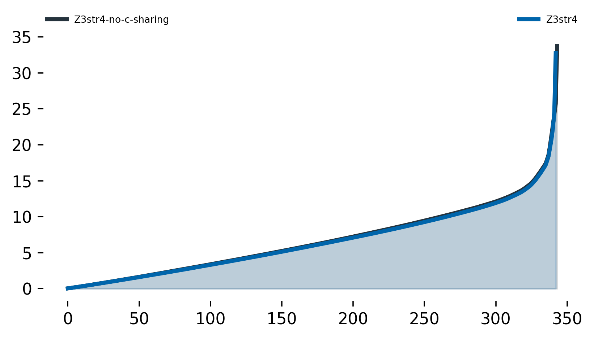

|===
|Solver |Cor. class. (contr.) |SAT |UNSAT |UNKN |ERR |CRA |TO |Par2 |Tot. inst. |Tot. inst. w/o TO | Tot. time |Tot. time w/o TO
|+++<span style="color: #25333D;font-weight: bold;">Z3str4-no-c-sharing</span>+++|344 (0.52)|54|290|0|0|0|13|553746|357|344|293746|33746
|+++<span style="color: #0065AB;font-weight: bold;">Z3str4</span>+++|343 (0.0)|53|290|0|0|0|14|592769|357|343|312769|32769
|===

[NOTE]
====
+++<span style="color: #25333D;font-weight: bold;">Z3str4-no-c-sharing</span>+++ had the biggest lead with 1.0 and +++<span style="color: #25333D;font-weight: bold;">Z3str4-no-c-sharing</span>+++ hat the largest contribution with 0.52. Other solvers contributed as follows: +++<span style="color: #0065AB;font-weight: bold;">Z3str4</span>+++: 0.0.
====

=== automatark25


[.text-center]
image::img_CLAUSE/automatark25.png[cactus]

|===
|Solver |Cor. class. (contr.) |SAT |UNSAT |UNKN |ERR |CRA |TO |Par2 |Tot. inst. |Tot. inst. w/o TO | Tot. time |Tot. time w/o TO
|+++<span style="color: #0065AB;font-weight: bold;">Z3str4</span>+++|19925 (0.0)|14465|5460|0|0|0|54|4703025|19979|19925|3623025|2543025
|+++<span style="color: #25333D;font-weight: bold;">Z3str4-no-c-sharing</span>+++|19925 (0.0)|14465|5460|0|0|0|54|4804125|19979|19925|3724125|2644125
|===

[NOTE]
====
+++<span style="color: #0065AB;font-weight: bold;">Z3str4</span>+++ had the biggest lead with 1.0 and +++<span style="color: #25333D;font-weight: bold;">Z3str4-no-c-sharing</span>+++ hat the largest contribution with 0.0. Other solvers contributed as follows: +++<span style="color: #0065AB;font-weight: bold;">Z3str4</span>+++: 0.0.
====

=== stringfuzzregexgenerated


[.text-center]
image::img_CLAUSE/stringfuzzregexgenerated.png[cactus]

|===
|Solver |Cor. class. (contr.) |SAT |UNSAT |UNKN |ERR |CRA |TO |Par2 |Tot. inst. |Tot. inst. w/o TO | Tot. time |Tot. time w/o TO
|+++<span style="color: #0065AB;font-weight: bold;">Z3str4</span>+++|4114 (5.56)|3284|830|10|0|0|46|8199002|4170|4124|6879002|5959002
|+++<span style="color: #25333D;font-weight: bold;">Z3str4-no-c-sharing</span>+++|4114 (5.56)|3284|830|6|0|0|50|8517994|4170|4120|7277994|6277994
|===

[NOTE]
====
+++<span style="color: #0065AB;font-weight: bold;">Z3str4</span>+++ had the biggest lead with 1.0 and +++<span style="color: #25333D;font-weight: bold;">Z3str4-no-c-sharing</span>+++ hat the largest contribution with 5.56. Other solvers contributed as follows: +++<span style="color: #0065AB;font-weight: bold;">Z3str4</span>+++: 5.56.
====

=== stringfuzzregextransformed


[.text-center]
image::img_CLAUSE/stringfuzzregextransformed.png[cactus]

|===
|Solver |Cor. class. (contr.) |SAT |UNSAT |UNKN |ERR |CRA |TO |Par2 |Tot. inst. |Tot. inst. w/o TO | Tot. time |Tot. time w/o TO
|+++<span style="color: #0065AB;font-weight: bold;">Z3str4</span>+++|10679 (0.0)|4631|6048|0|0|0|3|597563|10682|10679|537563|477563
|+++<span style="color: #25333D;font-weight: bold;">Z3str4-no-c-sharing</span>+++|10679 (0.0)|4631|6048|0|0|0|3|608339|10682|10679|548339|488339
|===

[NOTE]
====
+++<span style="color: #0065AB;font-weight: bold;">Z3str4</span>+++ had the biggest lead with 1.0 and +++<span style="color: #25333D;font-weight: bold;">Z3str4-no-c-sharing</span>+++ hat the largest contribution with 0.0. Other solvers contributed as follows: +++<span style="color: #0065AB;font-weight: bold;">Z3str4</span>+++: 0.0.
====

=== Total


[.text-center]
image::img_CLAUSE/total.png[cactus]

|===
|Solver |Cor. class. (contr.) |SAT |UNSAT |UNKN |ERR |CRA |TO |Par2 |Tot. inst. |Tot. inst. w/o TO | Tot. time |Tot. time w/o TO
|+++<span style="color: #0065AB;font-weight: bold;">Z3str4</span>+++|116439 (61.45)|71842|44597|170|0|0|3757|189396964|120366|116609|107456964|32316964
|+++<span style="color: #25333D;font-weight: bold;">Z3str4-no-c-sharing</span>+++|116422 (52.67)|71827|44595|159|0|1|3785|191718754|120366|116581|109658754|33958754
|===

[NOTE]
====
+++<span style="color: #0065AB;font-weight: bold;">Z3str4</span>+++ had the biggest lead with 1.0 and +++<span style="color: #0065AB;font-weight: bold;">Z3str4</span>+++ hat the largest contribution with 61.45. Other solvers contributed as follows: +++<span style="color: #25333D;font-weight: bold;">Z3str4-no-c-sharing</span>+++: 52.67.
====
